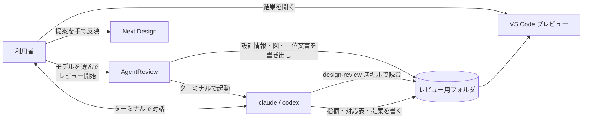
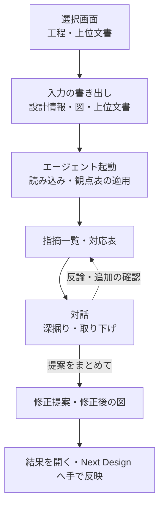

# はじめに

本文書は Next Design の拡張機能 AgentReview（リボンの表示名は「AI レビュー」）の紹介である。選んだモデルの設計情報と図をファイルに書き出し、ターミナルで Claude Code または Codex のエージェントを起動して設計レビューをさせる。

Next Design V3.x の拡張機能の画面ではエージェントとの対話画面を作れない。そこで拡張機能は入力の準備と起動・結果表示だけを受け持ち、対話はターミナル上の claude / codex に任せる形にした。

# 何ができるようになるか

工程（要件分析／アーキ設計／詳細設計）に合った観点で設計をレビューさせ、指摘・上位文書との対応表・修正提案をファイルで受け取れるようになる。結果は VS Code の Markdown プレビューで読む。

| 方式 | 作るもの | 向いている場面 |
|---|---|---|
| レビュー開始 | 指摘一覧・対応表・修正提案・修正後の図 | 選んだ成果物を工程の観点で一通り見たいとき |
| 変化点レビュー | 上記に加え、変更の一覧と影響範囲のまとめ | Git の過去版から変わった部分とその影響だけを見たいとき |
| 設計情報を出力 | 設計情報の Markdown と図の PlantUML | レビューせず、設計情報だけを別の用途に使いたいとき |

ターミナルでエージェントに頼むことの例:

- 「指摘 No.3 を詳しく説明して」
- 「No.5 は仕様どおりなので取り下げて」
- 「提案をまとめて」

## できないこと

- **Next Design のモデルを直接直すことはできない。** 修正は `review/proposal.md` などの提案ファイルまでで、反映は人が Next Design 上で行う。
- **エージェントの作業完了は検知しない。** 結果がそろったかは「結果を開く」で確かめる。
- **Excel・Word・PDF がどこまで読めるかは保証しない。** エージェント側の環境による。読めなかった範囲は「判断できない」として結果に残る。
- **内容を取り出せなかった図はレビューできない。** 空の図とはみなさず `unverified-diagrams.md` に「未確認」として記録し、レビューは続ける。未確認の図は Next Design 上で確認する。
- **変化点レビューは手元にあるコミットだけを使う。** fetch や checkout はしない。上位文書は現在版だけを使い、上位文書自体の改訂差分は扱わない。
- **レビュー観点を利用者の手元で変えることは想定していない。** 観点表はチーム共通で、変更は管理者が拡張機能ごと配布し直す（[カスタマイズ](#カスタマイズ)）。

# 全体像



拡張機能が入力を固め、エージェントはそのフォルダの中だけで読み書きする。Next Design へ戻す矢印は利用者からだけ出ている。

拡張機能のフォルダ（配布物）:

```
AgentReview/
├── AgentReview.dll          ← 拡張機能の本体
├── manifest.json            ← リボンとコマンドの定義
├── resources/               ← リボンのアイコン
└── skills/design-review/    ← レビューの進め方（SKILL.md）と工程別の観点表
```

1回のレビューで作られるフォルダ（主なもの）:

```
[レビュー保存先]/[セッション]/
├── inputs.md                ← 何を入力にしたか（対象モデル、資料、日時など）
├── design/                  ← レビューに渡した設計情報（エージェントは書き換えない）
│   ├── design.md            ← 設計情報。分量が多いときは目次（ページ一覧）になる
│   ├── model/               ← 分量が多いときの本体。モデル階層と同じフォルダ構成
│   ├── paths.tsv            ← 短い ID から Next Design のモデルパスを引く表
│   ├── _index.md            ← 図の一覧
│   └── diagrams/            ← 図の PlantUML（クラス図 / シーケンス図 / 状態遷移図）
├── upstream/                ← レビューに渡した上位文書
└── review/                  ← エージェントの出力
    ├── review.md            ← 指摘の一覧
    ├── coverage.md          ← 上位文書の要求が設計に反映されているかの対応表
    ├── proposal.md          ← 修正提案
    ├── proposed/            ← 修正後の図（PlantUML）
    └── progress.md          ← ページに分かれているとき、どこまで読んだかの記録
```

# 環境構築

| 必要なもの | 用途 | 方式 |
|---|---|---|
| Next Design V3.x | 拡張機能を動かす | すべて |
| Claude Code（`claude`）または Codex（`codex`）の CLI | レビューするエージェント。PATH が通っていること | レビュー開始・変化点レビュー |
| VS Code | 「結果を開く」で結果をプレビュー表示する。追加の拡張機能は不要 | すべて |
| Git for Windows | 過去版の取り出し | 変化点レビューのみ |

配布された `AgentReview` フォルダ一式を次のどちらかに置き、Next Design を再起動する。リボンに「AI レビュー」タブが出れば完了である。

| 置き場所 | 使える人 |
|---|---|
| `%LOCALAPPDATA%\DENSO CREATE\Next Design\extensions\AgentReview\` | 自分だけ |
| `C:\ProgramData\DENSO CREATE\Next Design\extensions\AgentReview\` | その PC の全ユーザー |

CLI と VS Code のインストール、フォルダの配置は配布物の置き方や権限が人によって違うので、コマンド1つにはまとめていない。CLI が見つかるかは、リボンの「環境診断」で確かめる。

<details>
<summary>更新するとき・CLI を入れた直後</summary>

- 更新は Next Design を終了してからフォルダの中身を入れ替える。起動中は差し替えられない。
- CLI をインストールした直後は Next Design を再起動する。再起動しないと PATH の変更が見えず、エージェントが起動しない。

</details>

# 使い方

## レビューする

1. ナビゲータでレビューしたいモデルを選び、「レビュー開始」を押す。
2. **選択画面で工程を答える。** 要件分析／アーキ設計／詳細設計から選ぶ。
3. **上位文書を答える。** 詳細設計ならアーキ設計、アーキ設計なら要件分析書が上位にあたる。
   - モデルはツリーでチェックする。チェックしたモデルは配下も含めて渡す。モデル名やパスで検索できる。
   - Word・Excel・PDF などの資料は「資料ファイルを追加」で選ぶ。
   - 上位文書を使わない場合は「今回は上位文書なし」を押す。上位要求との整合は「未確認」として結果に残る。
4. 「レビュー開始」を押す。**初回だけ、レビュー結果の保存先フォルダを聞かれる。**
5. ターミナルでエージェントが起動し、自動でレビューを始める。工程はすでに伝わっているので聞き直されない。途中で質問されたらターミナルで答える。
6. 指摘を深掘り・取捨選択し終えたら「提案をまとめて」と頼む。エージェントが `review/proposal.md` を書く。
7. 「結果を開く」を押す。VS Code の新しいウィンドウに結果がプレビュー表示される。

選択画面の内容はプロジェクトと工程ごとに記憶され、次回は前回の選択が入った状態で開く。「今回は上位文書なし」を選んでも記憶した選択は消えない。「キャンセル」では何も保存・作成されない。保存していないプロジェクトでもレビューはできるが、選択は記憶されない。

対話を途中でやめた場合は、「ターミナル再開」で直近のレビューの続きから再開できる。

## リボンのボタン

| グループ | ボタン | 内容 |
|---|---|---|
| エージェント | レビュー開始 | 選んだモデルをレビューする |
| | ターミナル再開 | 直近のレビューの対話を続ける |
| | 変化点レビュー | Git の過去版と比べ、変わった部分をレビューする |
| 出力 | 設計情報を出力 | レビューせずに設計情報と図だけを書き出す |
| 結果 | 結果を開く | 直近のレビュー結果を VS Code で開く |
| | フォルダを開く | 直近のレビューのフォルダをエクスプローラーで開く |
| 設定 | エージェント切替 | Claude Code と Codex を切り替える |
| | スキルを開く | レビュー手順と工程別の観点表を開く |
| | 設定 | 保存先・エージェント・VS Code などを設定する |
| | 環境診断 | claude / codex CLI の有無とバージョンを表示する |
| | エクスポート診断 | 設計情報に出ない項目を調べるため、モデルの中身を書き出す |
| | 過去版出力の検証 | 過去版のプロジェクトから本文と図が出力できるかを試す。エージェントは起動しない |

## レビューに使われる情報

- モデルは Next Design で開いている現在の内容を使う。保存していない編集も含まれる。
- 資料ファイルはディスクに保存されている内容を、レビュー開始時点でコピーして使う。
- プロジェクトファイルと同じ場所に `Attachment` フォルダがあれば、エージェントからも見えるようにする。コピーはせず、元のフォルダを参照する。

## 結果を読む

「結果を開く」で直近のレビューのフォルダが VS Code で開く。各ファイルの役割は[全体像](#全体像)のツリーのとおりである。結果がまだないときは案内が出る。プレビューではなく編集画面で開きたいときは、VS Code の「エディターを再度開く…」からテキストエディターを選ぶ。

設計情報（`design/design.md`）は次のように書かれている。

- 見出しは Next Design のモデル階層に沿って並ぶ。
- 属性・引数・定数・操作のように子を持たない短いモデルは、型ごとに1行1件の表になる。1つの区画に型の違う表が並ぶときは、各表の前に型名が付く。引数を持つ操作やメンバーだけの構造体も表の1行になり、表の後に見出しと子の表が続く。
- 複数行の値は、短ければ（10行・400文字まで）表のセルの中で `<br>` でつながる。リッチテキストは表に入れない。
- 型名などの `<` は、プレビューでタグとみなされて消えないよう `\<` と書かれている（例: `std::array\<SIDFilterType>`）。
- 各モデルには `m` で始まる短い ID が付く（見出しの下の非表示コメントと、表の右端の列）。`design/paths.tsv` で ID から Next Design のモデルパスを引ける。エージェントは指摘の場所をここから書く。
- 全体が1ファイル2万文字または1,000行を超えるときは、`design/model/` の下に Next Design のナビゲータと同じ階層でファイルを分ける。`クラス設計.md` の配下は同名のフォルダ `クラス設計/` の中にある。各ページの先頭に上位ページへのリンクがあり、`design.md` の「ページ一覧」から全ページをたどれる。
- 保存先からのパスが長くなりすぎるページだけ、経路の中で一番長い名前を `~` とハッシュ付きの短い名前に縮める。
- ページ・図へのリンク先は日本語のまま `<…>` で囲んで書かれ、VS Code のプレビューからそのまま開ける。
- 同じフォルダへ出力し直すと、前回作ったページのうち今回なくなったものは消える。手で編集したページは消さずに残す。

図（シーケンス図・クラス図・状態遷移図）は PlantUML（`.puml`）として書き出され、`design.md` の該当箇所から参照される。フォルダは、図をまとめているグループの名前から階層を作る。通常は設定不要である。

## 変化点レビュー

Git で管理しているプロジェクトで、過去のコミットと今の設計を比べ、変わった部分とその影響をレビューする。

1. Git 管理下の保存済みプロジェクトを開き、比べたい成果物のモデルを選んで「変化点レビュー」を押す。
2. 通常のレビューと同じ画面で、工程と上位文書を選ぶ。
3. **比較元を答える。** ブランチまたはタグを選び、一覧からコミットを選ぶ。履歴は100件ずつ追加で表示でき、表示中の項目を検索できる。
4. 拡張機能が過去版を取り出す。**過去版でプロジェクトファイルの場所が違う場合は、候補から選ぶ。**
5. 成果物はモデル ID で対応させる。**過去版に同じ ID がなければ、ツリーから選ぶか「過去版にはない新規成果物」を選ぶ。**
6. 差分があればエージェントが起動する。差分がなければ起動せず、保存先を案内する。

比べるのは「今開いている内容（未保存の編集を含む）」と「選んだコミット」である。作業中のファイルは変わらない。進捗画面からキャンセルできる。

結果は通常のレビューと同じフォルダ構成に、次のファイルが加わる。

| ファイル | 内容 |
|---|---|
| `diff/changes.md` | 機械的に取り出した変更の一覧 |
| `review/changes.md` | エージェントがまとめた変更の概要と影響範囲 |
| `baseline/` | 過去版のプロジェクトと設計情報 |

## 設計情報だけを出力する

「設計情報を出力」を押すと、レビューせずに `design.md`（分量が多ければ `model/` 配下のページも）・`paths.tsv`・`_index.md`・`diagrams/` を選んだフォルダへ書き出す。エージェントは起動しない。前回出力したページは整理されるが、図の `.puml` は自動では消さないので、新しいフォルダを選ぶのが確実である。

# ベストプラクティス

- **編集中の資料は保存してからレビューを始める。** 資料はディスク上の内容を開始時点でコピーするため、未保存の編集は渡らない。
- **上位文書はできるだけ指定する。** 指定しないと上位要求との整合は「未確認」で終わり、漏れの指摘が出ない。
- **工程は成果物に合わせて正しく選ぶ。** 観点は工程で変わり、要件分析の成果物に詳細設計の観点を当てると的外れな指摘になる。
- **提案を確定させる前に、指摘への反論や背景はターミナルで伝える。** 合意しなかった指摘は取り下げとして記録され、提案に入らない。
- **設計情報だけを出力するときは新しいフォルダを選ぶ。** 図の `.puml` は自動で消えないため、古い図が残る。
- **レビューのフォルダはエクスプローラーで削除する。** PowerShell 5.1 の `Remove-Item -Recurse` は、参照している元の `Attachment` の中身まで消すことがある。
- **変化点レビューで使うプロファイルや分割モデルは同じリポジトリに入れておく。** 過去版を開くのに必要なファイルが無いと止まる。

# ワークフロー



## 担当と機械検査

| 工程 | AI（ツール）が行うこと | ユーザーが行うこと | 機械検査 |
|---|---|---|---|
| 選択画面 | 拡張機能: 前回の選択を復元する | 工程・上位文書・資料を選ぶ | 選択内容の入力検証 |
| 入力の書き出し | 拡張機能: 設計情報・図・上位文書・`inputs.md` を書き出し、スキルを用意する | なし（初回だけ保存先を選ぶ） | スキルの `SKILL.md` と工程別観点表の有無。無ければ止まる |
| 読み込み・レビュー | エージェント: 全ページを読み、観点表の全観点を当て、`review.md` と `coverage.md` を書く | 質問されたら答える | なし |
| 対話 | エージェント: 指摘の具体化・取り下げを記録する | 反論・背景の説明、取捨選択 | なし |
| 修正提案 | エージェント: `proposal.md` と `proposed/` の図を書く | 「提案をまとめて」と頼む | なし |
| 反映 | 拡張機能: 結果を VS Code で開く | 提案を読み、Next Design 上で反映する | なし |

合意した指摘がすべて `review/proposal.md` に反映され、エージェントが要約を示した時点でレビューは完了である。

## 機械で見ているもの・見ていないもの

拡張機能が見るもの:

| 対象 | 検査内容 |
|---|---|
| CLI | 「環境診断」で claude / codex が見つかるかとバージョン |
| スキル | レビュー開始時に `SKILL.md` と工程別観点表がそろっているか |
| 図 | 内容を取り出せたか。取り出せなければ `unverified-diagrams.md` に記録する |
| 変化点レビューの過去版 | LFS・サブモジュール・シンボリックリンク・Windows で扱えない名前が含まれていないか。含まれていれば止まる |
| 再出力 | 前回出力したページが手で編集されていないか。編集されていれば消さずに残す |

見ていないもの（人の確認に残る）:

- 指摘の妥当性と重要度
- エージェントが全ページ・全観点を本当に当てたか（`review/progress.md` の記録はエージェント自身が書く）
- 資料ファイルがエージェント側で読めたかどうか
- 修正提案が Next Design 上で正しく反映されたか
- `unverified-diagrams.md` に載った図の内容

# カスタマイズ

設定はリボンの「設定」で開く。「保存」で次のボタン操作から反映され、Next Design の再起動は不要である。設定は `%USERPROFILE%\.nd-agent-review\config.ini` に保存される。

| 項目（設定画面） | 現状 | 変えたくなる場面と編集方法 |
|---|---|---|
| 使用するエージェント（基本設定） | Codex | Claude Code を使いたいとき。設定画面か「エージェント切替」で切り替える |
| レビュー保存先（基本設定） | 空欄（レビュー開始時に選ぶ） | 毎回同じ場所に置きたいとき。参照ボタンで既存のフォルダを選ぶ |
| VS Code（基本設定） | 空欄（既定のインストール先と PATH から自動検出） | VS Code が見つからないとき。`Code.exe` を選ぶ |
| ターミナル（基本設定） | 自動選択（Windows Terminal があれば使う） | コマンドプロンプトで開きたいとき |
| 追加のレビュー観点（基本設定） | 空欄 | 観点表に加えて見てほしい点があるとき。カンマ区切りで書く。工程別の観点表は置き換わらない |
| Codex / Claude Code コマンド（詳細設定） | `codex` / `claude` | コマンド名が違う・フルパスで指定したいとき |
| Codex / Claude Code 追加引数（詳細設定） | 空欄 | 権限の確認を減らしたいときなど。設定ファイルには例として `--permission-mode acceptEdits`（Claude Code）、`--sandbox workspace-write`（Codex）が書かれている |
| 開始時のメッセージ（詳細設定） | `レビューを開始してください` | 起動直後に別の指示を送りたいとき。空欄にすると自動送信しない |
| 図の階層ルール（詳細設定） | 空欄（図のグループを自動判別） | 図のフォルダ分けが意図と違うとき。対応表（`.ini`）を選ぶ。読み込めない・該当しない場合は警告して自動判別に戻る |

レビューの進め方と工程別の観点表は、拡張機能に同梱した `skills/design-review/` にある。「スキルを開く」で中身を確認できる。

| ファイル | 現状 | 変えたくなる場面と編集方法 |
|---|---|---|
| `skills/design-review/references/requirements-review.md` | 要求分析の観点（R-1 一意性・明確性 から） | チームの観点を足したい・直したいとき。管理者に依頼する |
| `skills/design-review/references/architecture-review.md` | アーキ設計の観点（A-1 構造分割の妥当性 から） | 同上 |
| `skills/design-review/references/detailed-design-review.md` | 詳細設計の観点（D-1 クラス/関数の責務 から） | 同上 |
| `skills/design-review/references/upstream-review.md` | 上位要求との整合の確認手順 | 同上 |
| `skills/design-review/SKILL.md` | レビューの手順・出力形式・禁止事項 | 同上 |

観点はチームで共通である。手元で直さず、拡張機能の管理者に依頼する。管理者が更新した拡張機能を配布し直すと、次のレビューから反映される。

# 困ったとき

| 症状 | まず見るところ |
|---|---|
| エージェントが起動しない | 「環境診断」で CLI が見つかるか確認する。インストール直後なら Next Design を再起動する |
| 選択画面が開かない・エラーになる | エラー画面に出る診断ログ（`%USERPROFILE%\.nd-agent-review\diagnostics\picker-*.txt`）を管理者に送る |
| 「スクリプトの実行が無効」と出る | 古い版のメッセージである。拡張機能を最新版に入れ替えて Next Design を再起動する |
| 設計情報に出てほしい項目が出ない | 対象モデルを選んで「エクスポート診断」を実行し、出力を管理者に送る |
| 結果を開いても何も出ない | エージェントがまだ作業中の可能性がある。ターミナルを確認する |
| 「結果を開く」で VS Code が開かない | 「設定」の「VS Code」で `Code.exe` を指定する |

開発・保守向けの情報（仕組み、ビルド、テスト、変更履歴）は [DEVELOPMENT.md](DEVELOPMENT.md)、実機での確認手順は [VERIFY.md](VERIFY.md) にある。

# 関連

- [PlantUmlTool](../PlantUmlTool/README.md)：図を PlantUML に出力し、PlantUML から図を更新・作成する。AgentReview の図の出力はこれと同じ仕組みだが、AgentReview は図を書き戻さない。
- [NdMcp](../NdMcp/README.md)：AI クライアントから Next Design のモデルを読み書きする。AgentReview と違い、AI がモデルを編集できる。
