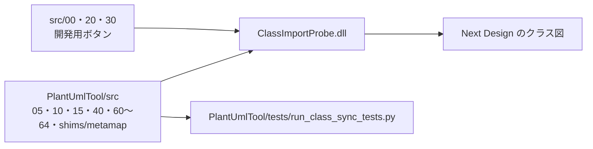

# はじめに

本文書は ClassImportProbe（リボン表示名「クラス図同期実験」）の紹介である。PlantUmlTool のクラス図同期を開発し、実機で確かめるための開発用 DLL 拡張である。

PlantUmlTool は利用者向けの機能（反映・新規作成）だけを持つ。差分の検証、結果の詳細表示、メタモデルの調査といった開発中にだけ要る操作はここに置いている。

# 何ができるようになるか

開いているクラス図に対して、PlantUML との差分の検証・反映・新規作成を行い、その詳細を見られる。プロファイルごとに違うメタクラス名やフィールド名を、実機から調べることもできる。

| グループ | ボタン | 内容 |
|---|---|---|
| 反映 | 差分を検証 | 開いているクラス図と PlantUML の差分を計算して表示する。書き込みはしない |
| | PlantUMLを反映 | PlantUmlTool の反映と同じ処理を実行する |
| | PlantUMLから新規作成 | PlantUmlTool の新規作成と同じ処理を実行する |
| 結果・診断 | 診断表示 | このタブのボタンで実行した直前の結果を、ページ送りで表示する |
| | クラス図調査 | 開いている図の `EditorType`・ビュー定義・ノードと子モデルの `ClassName`・コネクタの参照フィールドを出力ウィンドウに書く |
| | 新規作成の箱置き調査 | 既存のクラス図を手本に、新しい図へ箱（ノード）を置けるかを仮の図で試す。仮の図は最後に削除し、保存しない |

依頼の例:

- 「このプロファイルのクラス図をクラス図調査して、対応表を埋めて」
- 「差分を検証で出た更新の中身を診断表示で確かめて」

## できないこと

- **利用者向けの機能ではない。** クラス図同期を使うだけなら PlantUmlTool のボタンを使う。
- **PlantUmlTool のボタンで実行した結果は「診断表示」に出ない。** PlantUmlTool の結果は、PlantUmlTool の診断ファイルにある。
- **ローカルテストは Next Design を動かさない。** 実機での反映の成否は Next Design 上で確かめる。

# 全体像



同期の本体は PlantUmlTool のソースをそのままビルドする。ClassImportProbe が持つのは調査用のコードとボタンだけである。

```
ClassImportProbe/
├── ClassImportProbe.csproj          ← ビルドするソースを記載順に列挙する（PlantUmlTool/src のファイルを含む）
├── manifest.json                    ← リボンとコマンドの定義
└── src/
    ├── 00-extension.cs              ← エントリポイントとボタンのハンドラ
    ├── 20-class-probe.cs            ← クラス図調査（メタモデルのダンプ）
    └── 30-node-placement-probe.cs   ← 新規作成の箱置き調査
```

# 環境構築

.NET SDK と、Visual Studio なしでのビルド環境は [DLL 形式エクステンションの開発環境](../docs/dll-extension-setup.md) にまとめてある。

| 必要なもの | 用途 |
|---|---|
| .NET SDK | DLL のビルド |
| Python | クラス図同期のテスト |
| Next Design V3.x | 実機確認 |

リポジトリ直下で実行する。

```powershell
# クラス図同期の純粋部（パーサ・差分計画）の試験。ClassImportProbe 専用のテストは無い
python PlantUmlTool/tests/run_class_sync_tests.py
# ビルドして extensions フォルダへ配置する（Next Design を終了してから）
powershell -NoProfile -ExecutionPolicy Bypass -File Tools/Publish-Extensions.ps1 -Name ClassImportProbe -Deploy
```

`-Deploy` は Next Design の起動中なら止まる。DLL は起動時にしか読み込まれないためである。配置先は `%LOCALAPPDATA%\DENSO CREATE\Next Design\extensions\ClassImportProbe\` で、配置前の中身は `work\deploy-backup\` に退避される。

# 使い方

## 対応表を埋める

1. クラス図を開き、「クラス図調査」を押す。開いていないと案内が出て止まる。
2. 出力ウィンドウの `EditorType`・ノードと子モデルの `ClassName` 一覧・コネクタの参照フィールドを確かめる。
3. PlantUmlTool の `KeywordMap` / `MemberKindMap` / `LinkMap` に写す。

## 差分を確かめてから反映する

1. クラス図を開き、「差分を検証」を押して PlantUML を選ぶ。
2. 「診断表示」で差分の詳細を読む。
3. 問題なければ「PlantUMLを反映」を押す。

# ベストプラクティス

- **同期の不具合は PlantUmlTool/src を直す。** ここでビルドしているのは PlantUmlTool と同じファイルなので、直したら使う拡張をすべてビルドし直す。
- **調べた実測値はローカル知識へ保存する。** プロファイル固有のメタクラス名・フィールド名は `.local/nd-knowledge/` に置き、追跡対象の文書には書かない。
- **反映の前に「差分を検証」を通す。** 書き込む前に差分の種類と件数を確かめられる。

# 困ったとき

| 症状 | まず見るところ |
|---|---|
| 配置で止まる | Next Design が起動していないか |
| クラス図調査が「クラス図を開いた状態で」と止まる | 図のエディタを前面に開いているか |
| 対応表に無いメタクラスが既定の扱いになる | 出力ウィンドウの `[warn]` 行と、クラス図調査の結果 |
| 調べた事実を探したい | `.local/nd-knowledge/index.md` |

# 関連

- `PlantUmlTool`：クラス図同期の本体と、利用者向けの反映・新規作成ボタンを持つ。
- `SequenceImportProbe`：シーケンス図同期の開発用拡張。
- [クラス図の差分同期：実装計画と進捗](../docs/class-sync-plan.md)・[版履歴](../docs/class-sync-history.md)：統合までの経緯。
