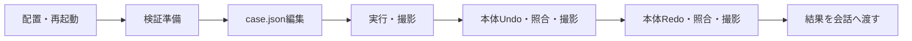

# 1. はじめに

ModelUpdateProbe 0.2.1 は、選択モデルまたはシーケンス図内のメッセージの文字列属性1件を更新し、変更後と手動Undo/Redo後の値を記録する検証用拡張です。会社PCで実行し、結果の要約画面を撮影して開発側へ渡します。

| 項目 | 内容 |
|---|---|
| 対象環境 | Windows / Next Design v3 系 / C#スクリプト拡張 |
| この版の実機動作確認 | 未実施。会社PCからの結果待ち |
| 開発側の確認 | 模擬SDKでのコンパイル・処理試験。実SDKへの適合や実機の画面表示は未確認 |
| 想定読者 | Next Designを操作できる検証担当者 |

# 2. インプット資料

- [記録票](RESULTS.md)：スクリーンショットと一緒に渡す情報。
- [検証ファイル記入例](example.case.json)：名称とIDは架空。実際には準備で生成されたファイルを使う。
- [APIと判定の説明](../docs/model-update-howto.md)：リポジトリの `docs/` で管理する。会社PCでは取得したリポジトリから参照する。
- [v3 IModel](https://docs.nextdesign.app/extension/v3.x/api/NextDesign.Core/IModel/) / [v3 IField](https://docs.nextdesign.app/extension/v3.x/api/NextDesign.Core/IField/) / [SetField](https://docs.nextdesign.app/extension/v3.x/api/NextDesign.Core/IModel/methods/SetField)。

# 3. 前提条件

- 実プロジェクトをコピーして開く。コピーの作り方は会社のプロジェクト管理手順に従う。
- 会社PCに書き込み可能な結果保存フォルダを用意する。ログには対象ID・フィールド名・属性値が入る。
- 比較中は他のモデル編集を挟まない。拡張は保存・Undo・Redo・自動復元を実行しない。
- 単値の `String` フィールドだけを対象とする。リッチテキスト・多値・数値・参照・モデルを所有するクラス型フィールドは対象外。文字列属性は `IsEmbedded` がtrueでも候補に含める。

# 4. 手順

## 4.1 概要



配置から結果受け渡しまで6段階。初回の所要時間は未測定。

## 4.2 配置と起動

1. 会社PCのリポジトリで `git pull --ff-only` を実行し、変更を取得する。検証結果を会社PCからコミット・プッシュする必要はない。
2. Next Designを終了し、取得したリポジトリの `ModelUpdateProbe` フォルダを会社PCの次の場所へそのままコピーする。ビルドやパッケージ生成は不要。

   ```text
   %LOCALAPPDATA%\DENSO CREATE\Next Design\extensions\ModelUpdateProbe\
       manifest.json
       main.cs
       README.md
       RESULTS.md
       example.case.json
       tests/                  （コピーされても実行時には使わない）
   ```

3. 同名フォルダが既にあれば内容と版を確認し、旧版を extensions の外に退避してから入れ替える。二重の `ModelUpdateProbe\ModelUpdateProbe` 階層にしない。
4. Next Designを起動し、コピーしたプロジェクトを開く。「設計更新検証」タブが表示されることを確認する。

修正版も同じ手順で取得・コピーする。`docs/` の共有資料はリポジトリ側で読む。実行時に必要なのは拡張フォルダ内の `manifest.json` と `main.cs` であり、共有資料への参照は動作に影響しない。

完了条件：リボンが表示される。スクリプトのコンパイルは最初のコマンド実行時なので、リボン表示だけではコンパイル成功としない。

## 4.3 シーケンス図内のメッセージを検証する

1. シーケンス図を開き、その図のモデルをナビゲータで選択する。図中の矢印やライフラインではなく、図を持つ相互作用モデルを選ぶ。
2. 「シーケンス検証準備」を押し、コピーの確認と保存先の選択を行う。準備画面のメッセージ数・ライフライン数・候補を持つメッセージ数を確認する。
3. 「対象一覧を開く」を押す。会社PC内で `targets.txt` が開く。名称・ID・現在値を見て、変更するメッセージ1件とその文字列属性を選ぶ。一覧のメッセージ順は作成順であり、図の上からの順序とは限らない。
4. 「検証ファイルを開く」を押す。対象一覧の `targetModelId` と候補の `fieldName` を `case.json` の空欄へ転記し、`newValue` を元と異なる短い文字列にする。先頭メッセージは自動選択しない。
5. `ndVersion`、`profile`、`profileVersion` を分かる範囲で記入して保存する。以降は4.5〜4.7の更新・照合手順へ進む。

更新対象は準備時に候補を持っていたメッセージ1件。図自体やライフラインのID、別の相互作用のメッセージIDは受け付けない。実行時に元の相互作用内に存在することを再確認する。対象が0件なら検証実行へ進まず、準備画面を撮影する。

属性の値と図上の表示文字列は一致するとは限らない。読戻しが一致しても、図のメッセージ表記が変わらなければ「表示反映なし」と記録する。この版ではメッセージの追加・削除・並べ替えは行わない。

## 4.4 選択モデル自体の属性を検証する

1. 検証するモデル1件をナビゲータで選択し、「検証準備」を押す。
2. コピーを開いていることを確認し、会社PC上の結果保存フォルダを選ぶ。配下に一意な `probe_日時_ID` フォルダができる。
3. 準備の結果画面を撮影する。候補数が0なら「診断完了 / 更新対象なし（F001）」と表示される。「検証実行」には進まず「フィールド診断」を押し、その画面も撮影する。
4. 「検証ファイルを開く」で、生成された `case.json` をメモ帳で開く。同じフォルダの `fields.txt` がフィールド一覧。
5. `fieldName` を目的の候補に変更し、`newValue` に元と異なる短い検証文字列を記入する。自動選択された先頭候補をそのまま使う場合も意味を確認する。
6. `ndVersion` にヘルプで確認した実機の詳細版を記入する。`profile` と `profileVersion` は分かる場合だけ記入し、不明なら「未確認」のままにする。保存する。

| キー | 指定 |
|---|---|
| `schemaVersion` | 文字列 `"1"`。全項目とも文字列で指定 |
| `caseId` | `S001` など英数字・`-`・`_` の1〜32文字。結果の要約に表示される |
| `targetModelId` | 生成されたIDを維持。他モデルのIDでは実行不可 |
| `fieldName` | `fields.txt` の名前と完全一致。表示名ではない |
| `newValue` | 変更後の文字列。空文字可、null不可 |
| 環境3項目 | ユーザー申告として記録。自動判定・適合性保証には使わない |

ファイルの場所は準備ごとに変わる。「検証実行」は現在の準備フォルダの `case.json` を読む。他のファイルを選ぶダイアログは出ない。

<details>
<summary>JSON内の改行・バックスラッシュ</summary>

改行は `\n`、引用符は `\"`、バックスラッシュは `\\` と書く。末尾カンマ・コメント・キー重複・未知のキーは使わない。UTF-8で保存する。上限はファイル1MB、内容256K文字。

</details>

完了条件：目的の属性と変更値が記入され、モデルはまだ変更されていない。

「フィールド診断」は準備時に取得した全フィールド数、型名がStringの件数、そのうち単値の件数、RichTextの件数、最終的な候補数を表示する。モデル名・フィールド名・実際の値は出ない。候補0はフィルターの結果であり、属性が一切ないことを意味しない。実際の型・多重度・除外条件は会社PCの `fields.txt` に記録する。

## 4.5 更新と撮影

1. 「検証実行」を押す。
2. 確認画面のモデル・フィールド・変更前後を確認する。この画面には実際の名称や値が出る。長文は100表示文字で省略する。
3. OKを押すと、呼出前ログを保存し、値を再取得してから `SetField` を1回呼ぶ。
4. 要約画面を撮影する。「呼出：正常終了」「期待値との照合：一致」「変更前との差：あり」「記録：保存済み」が通常の期待結果。
5. Next Designの実際の画面にも変更が現れたかを確認し、記録票に記入する。

「呼出：例外」でも読戻しが一致する場合がある。成功と読み替えず、そのまま渡す。結果は「結果表示」で再表示できる。「詳細（会社PC内）」は詳細記録をメモ帳で開く。

完了条件：要約を取得し、画面での観測結果を記録した。APIの成功だけで設計全体の妥当性を確認したとは扱わない。

## 4.6 Undo/Redo後の照合

1. 結果ダイアログを閉じ、Next Design本体のUndo（Ctrl+Z）を実行する。他の編集は挟まない。
2. リボンの「Undo後」を押し、照合結果を撮影する。元の値に戻れば「一致」「変更前との差：なし」。
3. 本体のRedoを実行し、「Redo後」を押して撮影する。変更値に戻れば「一致」「変更前との差：あり」。
4. 編集を取り消して検証を終える。取り消せない場合は保存せずコピーを閉じ、未変更のコピーからやり直す。

これらのボタンは値を読むだけで、Undo/Redoを呼ばない。「Undo後」という段階名はユーザーの選択であり、Undoが発生したことの自動検出ではない。

<details>
<summary>検証セッションの有効期間</summary>

1セッションにつき更新APIの呼び出しは1回。キャンセルや呼出前の検査失敗はファイルを直して再試行できる。一度APIを呼んだ後は、照合を済ませてから「検証準備」をやり直す。

プロジェクトを閉じる・切り替える・再読み込みする・Next Designを再起動する場合も再準備する。プロジェクトIDと保存先を比較し、対象モデルを現在のプロジェクトからIDで再取得する。ID・保存先の不一致や対象の欠落・削除・プロキシ化では停止する。同じID・保存先での再読み込み自体は自動検出しないため、再読み込み後の再準備は操作手順として必須。

</details>

## 4.7 結果の受け渡し

[RESULTS.md](RESULTS.md) を使い、準備・変更後・Undo後・Redo後の要約画面と、実機の詳細版を渡す。要約はモデル名・パス・属性値を表示しない。詳細やログを一括で持ち出す必要はない。

例外の理由を調べる際だけ、会社で共有可能な範囲の詳細を追加する。読めない部分を推測して転記しない。ログには変更前後の完全な値を保持し、過去のファイルを上書きしない。

# 5. トラブルシューティング

| 症状 | 対処 |
|---|---|
| タブが出ない | 配置階層と再起動を確認。マニフェストを変更した場合は再検査 |
| ボタンを押すとエラー・反応なし | 表示→出力のSystemカテゴリを確認し、コンパイルエラーの行番号とメッセージを共有 |
| 検証が停止 | 詳細ボタンで理由を確認。フィールド名、ID、型、編集可否を確認 |
| C001 | 準備状態がない。未準備か、準備後に状態が失われたかは未確定。準備完了の有無と操作順を添える |
| C002 | 現在のプロジェクトがない。プロジェクトを開いて再準備 |
| C003 | プロジェクトIDまたは保存先が不一致。開いているコピーと保存先を確認し、再準備 |
| C004 / C005 | 現在のプロジェクトに対象がない・削除済み / プロキシ。対象の状態を確認する |
| C006 / C007 | 保存先が未確定 / 再取得した対象のID・種類が不一致。保存済みのコピーで再準備 |
| S001 | 選択モデルがIInteractionではない。シーケンス図を持つモデルをナビゲータで選び直す |
| S002 | 相互作用モデルが削除済み・プロキシ。対象の状態を確認 |
| S003 / S004 | 準備した候補にないID、または元の図内に対象が存在しない。IDと所属を確認して再準備 |
| F001 | 更新候補0。「フィールド診断」の画面を渡して、対象属性の選び方を確認する |
| 記録が保存失敗 | 保存先の権限・空き容量を確認。更新が行われたかは「呼出」欄で判断。自動復元はされない |
| Undo/Redoの照合が不一致 | 本体で操作した順序と画面の値を記録。ほかの編集が混ざったかも記録 |
| 結果画面が見切れる | 複数枚に分けて撮影するか、要約を転記。画面レイアウトの実機確認も今回の対象 |
| 修正版が反映されない | フォルダを入れ替えてNext Designを再起動。結果タイトルの版を確認 |

# 6. 開発側の検査

```powershell
python ModelUpdateProbe/tests/run_tests.py
python C:/Users/ksk01/.agents/skills/nextdesign-script-extension/scripts/validate_manifest.py ModelUpdateProbe --nd-version 3
```

模擬試験は出荷する `main.cs` 全体を模擬SDKとコンパイルし、JSON、対象・型検査、更新回数、取消時の非更新、読戻し、ログ失敗、情報を含まない要約を確認する。会社PCにPythonやテストコードを配置する必要はない。

## 0.1.1の変更

停止理由をC001〜C005に分け、候補0では更新へ誘導しないようにした。保存したフィールド集計を表示する診断ボタンを追加した。更新対象を絞る条件、プロジェクトの参照比較、更新API自体は変更していない。

## 0.2.0の変更

単値Stringの判定からIsEmbeddedによる除外を外した。クラス型・列挙型・参照・多値の除外は維持する。「シーケンス検証準備」と「対象一覧を開く」を追加し、相互作用内のメッセージ1件を指定して検証できるようにした。プロジェクト参照の比較条件は変更していない。

## 0.2.1の変更

プロジェクトのオブジェクト参照比較を、IDと保存先の比較へ変更した。各操作時と更新直前に現在のプロジェクトから対象を再取得する。設定ファイルを開く操作はローカルファイルだけを参照する。未保存プロジェクトでは準備を止めるため、コピーを保存してから使う。
