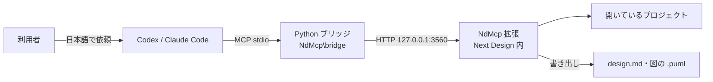
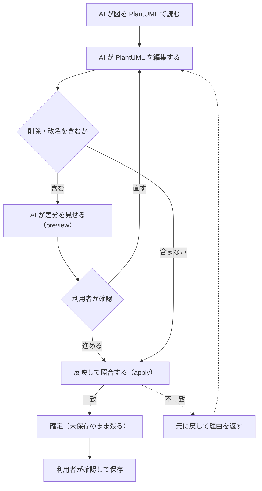

# はじめに

本文書は NdMcp の紹介である。NdMcp は、Next Design で開いているプロジェクトを Codex や Claude Code などの AI（MCP クライアント）から読み書きできるようにする拡張機能である。

設計情報を人が書き出して AI に貼り付けなくても、AI が必要なモデルを自分で読みに行き、頼まれた範囲で図やモデルを直せるようにする。

# 何ができるようになるか

AI に「この要求の設計を説明して」「改訂履歴に1行足して」「このシーケンス図にメッセージを追加して」と日本語で頼めるようになる。

| 対象 | できること |
|---|---|
| モデル全般 | 階層・内容・検索結果を読む |
| 設計書と図 | 設計書（Markdown）と図（PlantUML）をファイルに書き出す |
| クラス図 | PlantUML で読み、編集した内容を図とモデルに反映する |
| シーケンス図 | PlantUML で読み、編集した内容を図に反映する。PlantUML から新しい図も作れる |
| 図以外のモデル | フィールドの値・リッチテキスト・表の行・参照を編集する |

頼み方の例:

- 「プロジェクトの構成を教えて」
- 「○○モジュールの設計書と図を出力して」
- 「改訂履歴一覧に、今日の日付で1行追加して」

## できないこと

- **保存はしない。** AI の変更を残すかどうかは、Next Design 上で確認してから利用者が保存する。例外はシーケンス図の更新で `save` を指定したときで、更新の前にプロジェクトを保存する
- **クラス図を新しく作ることはできない。** 新規作成の API はシーケンス図だけにある
- **図の中でしか編集できないモデルは `nd_model_edit` で変えられない。** シーケンス図の要素などは Next Design が拒否する。シーケンス図の API を使う
- **複数値のスカラーフィールドに配列を設定することはできない。** 未対応である
- **別の PC からは使えない。** 同じ PC からの接続（`127.0.0.1`）だけを受け付ける。認証はないので、同じ PC で動く他のプログラムからは読める
- **Next Design の起動時にサーバーを自動で立ち上げることはできない。** 起動のたびに「サーバー開始」を押す

# 全体像



AI のツール呼び出しは Python ブリッジを通って Next Design 内の HTTP サーバーに届き、Next Design の画面スレッドで1件ずつ処理される。ブリッジは配布フォルダーの `NdMcp\bridge` を使い続ける。

```
NdMcp/
├── Setup.ps1        ← 配置と AI クライアントへの登録を1回で行うスクリプト
├── SETUP.md         ← セットアップ手順（正本）
├── manifest.json    ← 拡張機能の定義（リボン「NdMcp」タブ）
├── bridge/          ← Python ブリッジ（MCP ツールの定義）
├── src/             ← 拡張機能本体（HTTP サーバー・同期・モデル編集）
├── VERIFY.md        ← 実機での確認手順
└── DEVELOPMENT.md   ← 構成・HTTP API・ビルド・テスト・変更履歴
```

# 環境構築

手順の正本は [SETUP.md](SETUP.md) である。ここには要点だけを置く。

| 必要なもの | 用途 | 備考 |
|---|---|---|
| Windows と Next Design V3.x | 拡張機能を動かす | |
| Codex CLI または Claude Code CLI | AI クライアント | インストールしてログイン済みであること |
| インターネット接続 | 初回に uv・Python 3.12・ライブラリをダウンロードする | Python と uv の事前インストールは不要 |

Next Design と AI クライアントを終了し、`NdMcp` フォルダーが見える配布フォルダーで PowerShell を開いて実行する。

```powershell
# 拡張機能の配置、Python 環境の準備、Codex への nextdesign の登録をまとめて行う
# Claude Code なら -Client Claude、両方なら -Client Both
powershell -NoProfile -ExecutionPolicy Bypass -File .\NdMcp\Setup.ps1 -Client Codex
# 確認：最後に「SETUP COMPLETE: NdMcp [バージョン] / Codex」と表示されれば配置と登録は完了
```

接続の確認は1発では済まない。Next Design を起動してプロジェクトを開き、「サーバー開始」を押してから、AI に `nd_ping` と `nd_project` を実行させる必要があるためである。手順と AI に送る文面は [SETUP.md](SETUP.md) のステップ2・3にある。

<details>
<summary>注意点</summary>

- セットアップ後も配布フォルダーの `NdMcp\bridge` を使い続ける。フォルダーを消したり動かしたりしない。動かしたら新しい場所で同じコマンドを実行し直す
- 実際には変更せず、何をするかだけを見たいときは `-WhatIf` を付ける
- 更新するときも同じコマンドを実行し直す。取り外し方は [SETUP.md](SETUP.md) の「3. 翌日以降・更新・取り外し」にある

</details>

# 使い方

1. Next Design でプロジェクトを開く。
2. リボンの「NdMcp」タブで「サーバー開始」を押す。開始していないと、AI には「サーバー開始を押してください」という案内が返る。
3. Codex または Claude Code を起動し、やりたいことを日本語で頼む。
4. **ツールの実行を許可するか聞かれたら、`nextdesign` のツールであることを確かめて許可する。**
5. **削除・改名を含む編集では、AI が差分（preview）を見せてくる。** 内容を確かめてから反映を指示する。
6. 結果を Next Design 上で確認し、残すなら利用者が保存する。

## リボンのボタン

| グループ | ボタン | 内容 |
|---|---|---|
| MCP サーバー | サーバー開始 | AI からの接続を受け付け始める（`http://127.0.0.1:3560/`） |
| | サーバー停止 | 受け付けを止める |
| | 状態確認 | 稼働状態と直近の受信ログを出力ウィンドウに表示する |
| 設定 | 設定を開く | 設定ファイル（ポート・出力先）をメモ帳で開く |
| 編集の確認 | 書ける項目を出力 | 選んでいるモデルの値と書ける項目、行を1つ足す編集 JSON のひな形を書き出す。MCP サーバーも AI も不要 |
| | 編集 JSON を実行 | 選んだ編集 JSON を、AI からの編集（`nd_model_edit`）と同じ処理で実行する |

「編集の確認」の出力先は `%USERPROFILE%\.nd-mcp\edit-check\` で、`[日時]_model.json`（今の値）・`_schema.json`（書ける項目）・`_edit.json`（ひな形）・`_result.json`（実行結果）ができる。AI クライアントが使えない PC でも、モデル編集を試せる。

## AI が使うツール

AI は次のツールを自分で選んで使う。利用者がツール名を覚える必要はないが、うまく動かないときに「`nd_tree` で階層を見てから」のように指示すると確実である。

モデルは `path`（Next Design のモデルパス。例 `Project/要求/REQ-1`）か `id`（モデル ID）で指定する。どちらか一方でよい。

### 読む

| ツール | 内容 |
|---|---|
| `nd_ping` | 接続の確認（モデルには触らない） |
| `nd_project` | 開いているプロジェクトの名前・パス・直下のモデル |
| `nd_tree(path, id, depth)` | モデルの階層。`depth` は 0〜20（既定 2） |
| `nd_model(path, id)` | モデル1件の全フィールドと子。リッチテキストは Markdown で返す |
| `nd_search(query, metaclass, limit, count)` | モデル名の部分一致検索。`metaclass` でクラス名を絞り込める。既定で 50 件まで |
| `nd_markdown(path, id)` | 指定したモデル配下を設計書形式の Markdown で返す（図は含まない）。モデルは短い ID で示し、ID → モデルパスの対応も一緒に返す |
| `nd_export(path, id, out)` | 設計書と図をファイルに書き出す（下表）。`out` を省略すると `%USERPROFILE%\.nd-mcp\export` の下に日時付きのフォルダーを作る |

`nd_export` が書き出すもの:

| ファイル | 内容 |
|---|---|
| `design.md` | 設計書。分量が多いと目次（ページ一覧）になる |
| `model/` | 分量が多いときの設計書の本体。Next Design のモデル階層と同じフォルダー構成でページに分かれる |
| `paths.tsv` | `m` で始まる短い ID とモデルパスの対応 |
| `_index.md` | 図の一覧 |
| `diagrams/*.puml` | 図の PlantUML |

設計書の書式は AgentReview の「設計情報を出力」と同じである。子を持たない短いモデル（属性・引数など）はクラスごとの表にまとまり、ページ間のリンク先は日本語のまま `<...>` で囲んで書く。詳しい読み方は [AgentReview の README](../AgentReview/README.md) の「設計情報の読み方」にある。

### クラス図

| ツール | 内容 |
|---|---|
| `nd_class_diagram_editors(path, id)` | モデルが持つ図の一覧と、クラス図として扱えるか |
| `nd_class_diagram_puml(path, id, editor)` | クラス図を PlantUML で返す |
| `nd_class_diagram_preview(plantuml, path, id, editor, file, include_current)` | 編集した PlantUML と今の図の差分を返す。図は変えない |
| `nd_class_diagram_apply(plantuml, path, id, editor, file)` | 編集した PlantUML を図とモデルに反映する |

### シーケンス図

| ツール | 内容 |
|---|---|
| `nd_sequence_diagrams(path, id, limit, count, shapes)` | シーケンス図の一覧。既定で 50 件まで |
| `nd_sequence_diagram_puml(path, id, editor)` | シーケンス図を PlantUML で返す |
| `nd_sequence_diagram_preview(plantuml, path, id, editor, file)` | 編集した PlantUML と今の図の差分を返す。図は変えない |
| `nd_sequence_diagram_apply(plantuml, path, id, editor, file, save)` | 編集した PlantUML で図を更新する |
| `nd_sequence_diagram_create(plantuml, path, id, file)` | PlantUML から新しいシーケンス図を1枚作る。図の名前は `title` 行 |

`file` を使うと、PlantUML を本文ではなく Next Design が動く PC 上の `.puml` ファイル（300KB 以下）で渡せる。PlantUML の書式は PlantUmlTool で出力するものと同じである。

### 図以外のモデルを編集する

| ツール | 内容 |
|---|---|
| `nd_model_schema(path, id)` | 書き込めるフィールドと、追加できる表の行の種類 |
| `nd_model_edit(operations, dry_run)` | 値の設定・リッチテキスト・表の行の追加/削除/移動・参照の設定をまとめて実行する |

# ベストプラクティス

- **シーケンス図を AI に編集させる前にプロジェクトを保存する。** 未保存のまま更新すると、その後の Ctrl+Z は「最後に保存した状態の図形」に戻し、保存後に足した図形も消えるためである。
- **シーケンス図の更新を戻すときは Ctrl+Z ではなく、元の PlantUML を反映し直す。** メッセージやフラグメントを追加した更新を Ctrl+Z すると Next Design が止まる既知の不具合がある。
- **図の要素を削除・改名する編集は、先に差分（preview）を見せてもらう。** クラス図の削除は確認なしで実行される。シーケンス図は別名や並びを書き換えると「削除して追加」になり、既存の要素へのトレースが消える。
- **クラス図で関連を追加する前にプロジェクトを保存しておく。** 関連の追加を含む反映には保存済みであることが必要である。
- **クラス図の反映を戻したいときも、元の PlantUML を反映し直す。** Ctrl+Z ではモデルは戻るが、図に空の箱が残ることがある（図を切り替えて表示し直すと消える）。
- **`nd_markdown` や `nd_export` は対象のモデルを絞って頼む。** 処理中は Next Design の画面が操作できず、範囲が大きいとしばらく固まる。

# ワークフロー

図の反映（`*_apply`）の流れを示す。



## 担当と機械検査

| 工程 | AI（ツール）が行うこと | ユーザーが行うこと | 機械検査 |
|---|---|---|---|
| 依頼 | 必要なモデルや図を読む | 「サーバー開始」を押し、日本語で頼む。ツールの実行を許可する | なし |
| 差分の確認 | 削除・改名を含むときに preview で差分と反映できない理由を示す | 差分を読み、進めるか直させるかを決める | 反映できない理由の判定 |
| 反映 | 図に反映し、反映後の図を照合する | なし | 照合（一致しなければ元に戻す） |
| モデル編集 | `nd_model_edit` で操作をまとめて実行する | なし | 1件でも失敗すれば全部取り消す |
| 保存 | しない（シーケンス図で `save` を指定したときだけ更新前に保存する） | Next Design 上で結果を確かめ、保存する | なし |

照合が一致して確定し、利用者が保存した時点で完了である。

## 機械で見ているもの・見ていないもの

拡張機能が見るもの:

| 対象 | 検査内容 |
|---|---|
| 図の反映 | 反映した後の図が、渡した PlantUML と一致するか。一致しなければ元に戻す |
| モデル編集 | 各操作が成功したか。1件でも失敗すれば全部取り消し、失敗した位置とエラーを返す |
| 反映の前提 | 扱えない差分や停止条件に当たるか。当たれば反映せずに理由を返す |

見ていないもの（人の確認に残る）:

- 編集の中身が設計として正しいか
- 削除・改名が意図どおりか（照合は「PlantUML どおりになったか」しか見ない）
- 消えたトレースなど、PlantUML に現れない情報の影響

# カスタマイズ

設定ファイルは `%USERPROFILE%\.nd-mcp\config.ini`（`key=value` 形式）で、「設定を開く」で無ければ作られる。サーバーの開始時に読むので、変えたらサーバーを停止して開始し直す。通常は変える必要はない。

| 項目 | 現状 | 変えたくなる場面と編集方法 |
|---|---|---|
| `port` | `3560` | 他のプログラムとポートが競合するとき。値を変え、AI クライアントの登録の `ND_MCP_URL` も同じポートにそろえる。片方だけ変えると AI から接続できない。`Setup.ps1` は `3560` を前提に登録するので、再セットアップすると登録側は既定に戻る |
| `exportDir` | `%USERPROFILE%\.nd-mcp\export` | `nd_export` で `out` を省略したときの出力先を変えたいとき。パスを書く |

図をフォルダーに分ける規則は AgentReview と共有で、AgentReview の設定（`%USERPROFILE%\.nd-agent-review\config.ini` の `diagramGroups.rulesFile`）を参照する。未設定なら自動で判別する。

ログは `%USERPROFILE%\.nd-mcp\server.log` に残る。

# 困ったとき

| 症状 | まず見るところ |
|---|---|
| AI が「サーバーに接続できません」と言う | 同じ PC の Next Design でプロジェクトを開き、「サーバー開始」を押したか |
| AI に `nextdesign` のツールが見えない | AI クライアントを再起動したか。それでも見えなければ [SETUP.md](SETUP.md) の「4. うまくいかないとき」 |
| 応答が返ってこない | Next Design に確認ダイアログが出ていないか。範囲の大きい取得なら対象を絞る |
| サーバー開始でポートが使われていると出る | 別の Next Design がサーバーを開始していないか。開始するのは1つにそろえる |
| 「NdMcp」タブが出ない | Next Design を再起動してプロジェクトを開いたか |
| 状況が分からない | 「状態確認」を押し、出力ウィンドウの内容と `%USERPROFILE%\.nd-mcp\server.log` を担当者に送る |

開発・保守向けの情報（構成、HTTP API、ビルド、テスト、実機確認の状況、変更履歴、前の版への戻し方）は [DEVELOPMENT.md](DEVELOPMENT.md) にある。

# 関連

- [AgentReview](../AgentReview/README.md)：選んだモデルを AI にレビューさせる。設計書の書き出しは NdMcp の `nd_export` と同じ処理だが、AgentReview は AI がモデルを書き換えない
- [PlantUmlTool](../PlantUmlTool/README.md)：リボンから図を PlantUML で出力・反映・新規作成する。AI を使わずに同じ同期処理を使いたいときはこちら
