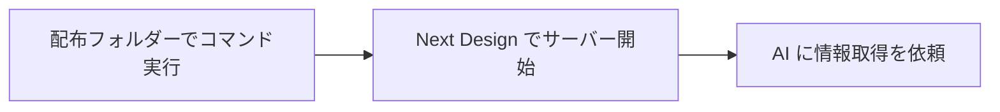

# 1. はじめに

Next Design の設計情報を Codex または Claude Code から取得するための手順である。初回はセットアップコマンドを実行し、Next Design でサーバーを開始する。

| 項目 | 内容 |
|---|---|
| 対象環境 | Windows / Windows PowerShell 5.1 以降 / Next Design V3.x / Codex CLI または Claude Code CLI |
| 実機確認 | 2026-09-19、NdMcp 0.1.1。Codex から `nd_ping`・`nd_project` が成功。各 HTTP API と図の出力もユーザー確認済み |
| 未確認の範囲 | Claude Code からの実機接続、新規PCでのセットアップ全工程。Claude Code の確認は導入の完了条件に含めない |
| 想定読者 | MCP・Python の環境構築に慣れていないチームメンバー |

**通常使うコマンドは次の1行。** リポジトリのフォルダーで PowerShell を開いて実行する。事前準備と実行後の操作は下記を参照する。

```powershell
powershell -NoProfile -ExecutionPolicy Bypass -File .\NdMcp\Setup.ps1 -Client Codex
```

# 2. インプット資料

| 資料 | 用途 |
|---|---|
| [README.md](README.md) | 利用できる機能と制約 |
| [Codex の MCP 設定](https://developers.openai.com/codex/mcp/) | Codex への登録方法 |
| [Claude Code の MCP 設定](https://code.claude.com/docs/en/mcp) | Claude Code への登録方法 |
| [uv のインストール](https://docs.astral.sh/uv/getting-started/installation/) | Python 環境の準備に使うツール |

# 3. 前提条件

- Next Design V3.x がインストールされ、対象プロジェクトを開ける。
- 使用する AI クライアントがインストールされ、ログイン済みである。PowerShell で `codex --version` または `claude --version` が通る。
- 配布フォルダーを、使い続けるローカルの場所へ保存している。セットアップ後も `NdMcp\bridge` を削除・移動しない。
- 初回はインターネットへ接続できる。uv・Python・Python パッケージのダウンロードが必要となる。
- Next Design と AI クライアントを終了している。作業中の設計データは先に保存する。

Python と uv の事前インストールは不要である。通常は管理者権限も不要で、現在の Windows ユーザー向けに設定する。

<details>
<summary>AIクライアントがまだ使えない場合</summary>

チームで指定された方法で、[Codex CLI](https://developers.openai.com/codex/cli/) または [Claude Code](https://code.claude.com/docs/en/setup) を導入する。導入後に PowerShell を開き直し、`codex` または `claude` を起動してログインする。通常の質問に回答が返るところまで確認する。

このセットアップは AI クライアント本体の導入、契約、ログインを自動化しない。会社の配布方法がある場合はそれに従う。

</details>

# 4. 手順

## 4.1 概要



全3ステップ。所要時間は未計測で、初回のダウンロード時間はネットワーク環境に依存する。

## 4.2 ステップ1：セットアップを実行する

1. エクスプローラーで `NextDesign_Script` フォルダーを開く。`NdMcp` フォルダーが見える位置である。
2. エクスプローラーのアドレスバーへ `powershell` と入力し、Enter を押す。
3. 使うクライアントに合わせて、次のいずれか1行をコピーして実行する。

Codex の場合：

```powershell
powershell -NoProfile -ExecutionPolicy Bypass -File .\NdMcp\Setup.ps1 -Client Codex
```

Claude Code の場合：

```powershell
powershell -NoProfile -ExecutionPolicy Bypass -File .\NdMcp\Setup.ps1 -Client Claude
```

両方を導入済みの場合：

```powershell
powershell -NoProfile -ExecutionPolicy Bypass -File .\NdMcp\Setup.ps1 -Client Both
```

スクリプトは順番に次を実行する。

| 処理 | 内容 |
|---|---|
| クライアント確認 | 選択した CLI が使えるか確認。見つからなければ変更前に停止 |
| uv の準備 | 既存の uv を使用。見つからない場合は Astral 公式インストーラーで導入 |
| Python・依存ライブラリの準備 | Python 3.12 と `uv.lock` に記録されたライブラリを準備 |
| 拡張機能の配置 | ビルド済みの `publish\`（`NdMcp.dll`・`manifest.json`・アイコンなど）を Next Design のユーザー用拡張フォルダーへコピー。`publish\` が無ければ .NET SDK でその場でビルドする。スクリプト版の `main.cs` はバックアップしてから外す |
| MCP 登録 | 選択したクライアントへ `nextdesign` を登録。既存の同名設定は更新 |

既存の拡張ファイルとクライアント設定ファイルは、変更前に同じ場所へ `.ndmcp-backup-日時` を付けて保存する。他の MCP サーバーの登録は維持する。Claude Code はユーザー設定だけを対象とし、プロジェクト固有の同名登録がある場合は後述の対処を行う。

**完了条件**：末尾に `SETUP COMPLETE: NdMcp 0.1.1 / Codex` など、バージョンと選択したクライアントが表示される。この時点では配置・登録が完了した状態で、実際の接続はステップ3で確認する。

<details>
<summary>配置先・設定先と変更内容を確認する</summary>

| 対象 | 場所 |
|---|---|
| Next Design 拡張 | `%LOCALAPPDATA%\DENSO CREATE\Next Design\extensions\NdMcp` |
| Python 環境 | 配布フォルダーの `NdMcp\bridge\.venv` |
| Codex 設定 | 通常は `%USERPROFILE%\.codex\config.toml`。`CODEX_HOME` 指定時はそのフォルダー内 |
| Claude Code 設定 | 通常は `%USERPROFILE%\.claude.json` |
| サーバー設定・ログ | `%USERPROFILE%\.nd-mcp\config.ini` / `server.log` |

実際に変更せず、対象と処理の概要を表示する場合：

```powershell
powershell -NoProfile -ExecutionPolicy Bypass -File .\NdMcp\Setup.ps1 -Client Codex -WhatIf
```

チームで拡張配置先を別途指定している場合は `-ExtensionDirectory '指定された絶対パス\NdMcp'` を付ける。

`ExecutionPolicy Bypass` はこの PowerShell プロセスにだけ指定する。会社のポリシーで実行できない場合は、管理者へスクリプトの配布・実行方法を確認する。

</details>

## 4.3 ステップ2：Next Design でサーバーを開始する

1. Next Design を起動する。
2. 情報を取得したいプロジェクトを開く。
3. リボンの「NdMcp」タブで「サーバー開始」を押す。
4. 「表示」から出力ウィンドウを開き、NdMcp カテゴリの開始ログを確認する。

**完了条件**：開始ログに `http://127.0.0.1:3560/` が表示され、エラーが出ていない。

Next Design は開いたままにする。通常はポート設定を変更する必要はない。

## 4.4 ステップ3：AI から情報を取得する

Codex または Claude Code を起動し、次をそのまま送る。セットアップ前から開いていたクライアントは再起動する。

```text
nextdesign の MCP ツールを実際に使って、次を順番に実行してください。
1. nd_ping で接続を確認する。
2. nd_project で現在開いているプロジェクトの情報を取得する。
成功した場合は結果を、失敗した場合はエラー内容を表示してください。
```

ツール実行の許可を求められた場合は、`nextdesign` の対象ツールであることを確認して許可する。

**完了条件**：`nd_ping` が `ok: true` を返し、`nd_project` に Next Design で開いているプロジェクト名が表示される。MCP サーバー一覧への表示だけでは完了にしない。

接続確認後は、例えば「モデルの階層を調べて」「○○というモデルの設計内容を説明して」と依頼する。設計書と図を出力したい場合は「対象モデルを確認してから `nd_export` で出力して」と依頼する。

## 4.5 翌日以降の利用・更新・取り消し

普段はセットアップを再実行する必要はない。Next Design でプロジェクトを開き、「サーバー開始」を押してから AI を使う。Python ブリッジは AI クライアントが起動する。

更新時は Next Design と AI クライアントを終了し、配布フォルダーを最新版に更新して、ステップ1と同じコマンドを実行する。その後、ステップ2・3で確認する。配布フォルダーを移動した場合も、新しい場所で再実行して登録パスを更新する。

登録を取り消す場合は、対象クライアントについて次を実行する。

```powershell
codex mcp remove nextdesign
claude mcp remove --scope user nextdesign
```

拡張機能を取り外す場合は Next Design を終了し、配置先の `NdMcp` フォルダーを拡張フォルダーの外へ移す。以前の版へ戻す場合は、バックアップの `manifest.json` と本体を元の名前で戻す。本体は、スクリプト版（0.2.1 以前）なら `main.cs`、DLL 版（0.3.0 以降）なら `NdMcp.dll`。スクリプト版へ戻すときは、配置先に残った `NdMcp.dll` などを拡張フォルダーの外へ移す。クライアント設定全体をバックアップから戻す際は、セットアップ後に行った他の設定変更も戻るため、変更内容を確認する。

# 5. トラブルシューティング

| 症状 | 対処 |
|---|---|
| `Setup.ps1` が見つからない | `NdMcp` が見えるフォルダーで PowerShell を開き直す。ZIP内ではなく展開先を使う |
| `codex` / `claude` が見つからない | クライアントを導入し、新しい PowerShell で `--version` を確認する。片方だけ使う場合は `Both` を指定しない |
| ダウンロード・証明書・プロキシのエラー | エラー全文を担当者へ渡し、会社の通信設定を確認する。解消後は同じコマンドを再実行する |
| `SETUP COMPLETE` が表示されない | 表示されたエラーから対処する。途中まで配置・登録されている場合もある。解消後に再実行する |
| 「NdMcp」タブが出ない | Next Design を再起動してプロジェクトを開く。指定の拡張配置先と出力ウィンドウの System カテゴリも確認する |
| AI に `nextdesign` が見えない | AI クライアントを再起動する。`codex mcp get nextdesign` または `claude mcp get nextdesign` で登録先を確認する |
| Claude Code が古い登録を使う・同名登録で失敗する | プロジェクトの `.mcp.json` やローカル設定に同名登録がないか確認する。チームの共有設定を無断で削除せず、担当者と登録先を統一する |
| 「サーバーに接続できません」 | 同じPCの Next Design でプロジェクトを開き、「サーバー開始」を押す |
| サーバー開始時にポート競合 | 別の Next Design がサーバーを起動していないか確認し、使用する1つに揃える |
| ブリッジのパスが見つからない | 配布フォルダーを移動・削除していないか確認する。移動先でセットアップを再実行する |
| 応答が返らない | Next Design に確認ダイアログが出ていないか確認する。大きな範囲の取得は、モデルを絞って実行する |

ポートを変更して運用する場合は、Next Design の `config.ini` の `port` と、クライアント登録の `ND_MCP_URL` を一致させる必要がある。本スクリプトは既定ポート `3560` での運用を対象とする。既存登録の独自の環境変数・引数は引き継がない。

問い合わせ時は、実行したコマンド、エラー全文、Next Design のバージョン、`codex --version` または `claude --version` の結果を添える。プロジェクト名やパスが含まれる結果は社内の共有先に限定する。
