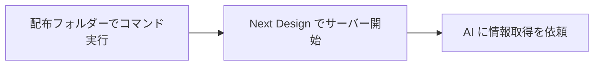

# NdMcp セットアップ手順

Next Design の設計情報を Codex または Claude Code から使えるようにする手順です。最初に1回だけセットアップのコマンドを実行し、あとは Next Design で「サーバー開始」を押すだけで使えます。

MCP や Python の環境構築に慣れていない人でも進められるように書いています。

通常使うコマンドは次の1行です。準備と実行後の確認は下の手順を見てください。

```powershell
powershell -NoProfile -ExecutionPolicy Bypass -File .\NdMcp\Setup.ps1 -Client Codex
```

## 1. 準備

- Next Design V3.x がインストールされ、対象のプロジェクトを開けること
- 使う AI クライアントがインストールされ、ログイン済みであること。PowerShell で `codex --version` または `claude --version` が通ればよい
- 配布フォルダーを、使い続けるローカルの場所に置いてあること。セットアップ後も `NdMcp\bridge` を削除・移動しないでください
- 初回はインターネットに接続できること（uv・Python・Python パッケージをダウンロードします）
- Next Design と AI クライアントを終了していること。作業中の設計データは先に保存してください

Python と uv を事前に入れておく必要はありません。管理者権限も通常は不要で、今の Windows ユーザー向けに設定します。

<details>
<summary>AI クライアントがまだ使えない場合</summary>

チームで指定された方法で [Codex CLI](https://developers.openai.com/codex/cli/) または [Claude Code](https://code.claude.com/docs/en/setup) を導入してください。導入後に PowerShell を開き直し、`codex` または `claude` を起動してログインします。普通の質問に回答が返れば準備完了です。

このセットアップは、AI クライアント本体の導入・契約・ログインまでは行いません。会社の配布方法がある場合はそれに従ってください。

</details>

## 2. 手順

全部で3ステップです。初回はダウンロードがあるので、ネットワーク環境によって時間がかかります。


```mermaid
flowchart LR
    A[配布フォルダーでコマンド実行] --> B[Next Design でサーバー開始]
    B --> C[AI に情報取得を依頼]
```

### ステップ1: セットアップを実行する

1. エクスプローラーで配布フォルダー（`NdMcp` フォルダーが見える場所）を開きます。
2. エクスプローラーのアドレスバーに `powershell` と入力して Enter を押します。
3. 使うクライアントに合わせて、次のどれか1行をコピーして実行します。

Codex の場合:

```powershell
powershell -NoProfile -ExecutionPolicy Bypass -File .\NdMcp\Setup.ps1 -Client Codex
```

Claude Code の場合:

```powershell
powershell -NoProfile -ExecutionPolicy Bypass -File .\NdMcp\Setup.ps1 -Client Claude
```

両方使う場合:

```powershell
powershell -NoProfile -ExecutionPolicy Bypass -File .\NdMcp\Setup.ps1 -Client Both
```

スクリプトは次の順に進みます。

| 処理 | 内容 |
|---|---|
| クライアントの確認 | 選んだ CLI が使えるか確認する。見つからなければ何も変えずに止まる |
| uv の準備 | 既にある uv を使う。なければ公式のインストーラーで入れる |
| Python とライブラリの準備 | Python 3.12 と必要なライブラリを用意する |
| 拡張機能の配置 | Next Design のユーザー用拡張フォルダーへ NdMcp をコピーする |
| MCP の登録 | 選んだクライアントに `nextdesign` という名前で登録する。同じ名前の登録があれば更新する |

変更する前に、既存の拡張ファイルとクライアントの設定ファイルを、同じ場所に `.ndmcp-backup-日時` を付けて保存します。ほかの MCP サーバーの登録はそのまま残ります。

**終わったら**: 最後に `SETUP COMPLETE: NdMcp <バージョン> / Codex` のように、バージョンと選んだクライアントが表示されます。この時点では配置と登録が済んだだけなので、接続はステップ3で確認します。

<details>
<summary>どこに何が置かれるか</summary>

| 対象 | 場所 |
|---|---|
| Next Design の拡張機能 | `%LOCALAPPDATA%\DENSO CREATE\Next Design\extensions\NdMcp` |
| Python 環境 | 配布フォルダーの `NdMcp\bridge\.venv` |
| Codex の設定 | 通常は `%USERPROFILE%\.codex\config.toml`（`CODEX_HOME` を指定していればその中） |
| Claude Code の設定 | 通常は `%USERPROFILE%\.claude.json`（ユーザー設定だけを変更します） |
| サーバーの設定・ログ | `%USERPROFILE%\.nd-mcp\config.ini` / `server.log` |

実際には変更せず、何をするかだけを表示したいときは `-WhatIf` を付けます。

```powershell
powershell -NoProfile -ExecutionPolicy Bypass -File .\NdMcp\Setup.ps1 -Client Codex -WhatIf
```

チームで拡張機能の置き場所が決まっている場合は `-ExtensionDirectory '指定された絶対パス\NdMcp'` を付けます。

`ExecutionPolicy Bypass` はこの PowerShell の実行にだけ効きます。会社のポリシーで実行できない場合は、管理者にスクリプトの実行方法を確認してください。

</details>

### ステップ2: Next Design でサーバーを開始する

1. Next Design を起動します。
2. 使いたいプロジェクトを開きます。
3. リボンの「NdMcp」タブで「サーバー開始」を押します。
4. 「表示」から出力ウィンドウを開き、NdMcp の開始ログを確認します。

**終わったら**: 開始ログに `http://127.0.0.1:3560/` が表示され、エラーが出ていなければ成功です。

Next Design は開いたままにしておきます。ポートの設定は通常変えません。

### ステップ3: AI から情報を取得する

Codex または Claude Code を起動し、次をそのまま送ります。セットアップ前から開いていたクライアントは再起動してください。

```text
nextdesign の MCP ツールを実際に使って、次を順番に実行してください。
1. nd_ping で接続を確認する。
2. nd_project で現在開いているプロジェクトの情報を取得する。
成功した場合は結果を、失敗した場合はエラー内容を表示してください。
```

ツールの実行を許可するか聞かれたら、`nextdesign` のツールであることを確かめて許可します。

**終わったら**: `nd_ping` が `ok: true` を返し、`nd_project` に Next Design で開いているプロジェクト名が出れば完了です。MCP サーバーの一覧に表示されるだけでは、まだ接続できたとは言えません。

あとは「モデルの階層を調べて」「○○というモデルの設計内容を説明して」のように頼めます。できることは [README.md](README.md) を見てください。

## 3. 翌日以降・更新・取り外し

普段はセットアップをやり直す必要はありません。Next Design でプロジェクトを開いて「サーバー開始」を押してから、AI を使ってください。

更新するとき:

1. Next Design と AI クライアントを終了します。
2. 配布フォルダーを最新版にします。
3. ステップ1と同じコマンドを実行し、ステップ2・3で確認します。

配布フォルダーを移動した場合も、新しい場所で同じコマンドを実行し直してください。登録されているパスが更新されます。

AI クライアントから登録を外すときは、使っているクライアントについて次を実行します。

```powershell
codex mcp remove nextdesign
claude mcp remove --scope user nextdesign
```

拡張機能を取り外すときは、Next Design を終了してから、配置先の `NdMcp` フォルダーを拡張フォルダーの外へ移します。前の版に戻したい場合は、自分で戻さずに担当者に相談してください（セットアップ時のバックアップから戻せます）。クライアントの設定ファイルをバックアップから丸ごと戻すと、セットアップ後に行ったほかの設定変更も戻るので注意してください。

## 4. うまくいかないとき

| 症状 | 対処 |
|---|---|
| `Setup.ps1` が見つからない | `NdMcp` が見えるフォルダーで PowerShell を開き直す。ZIP の中ではなく、展開したフォルダーを使う |
| `codex` / `claude` が見つからない | クライアントを入れて、新しい PowerShell で `--version` を確認する。片方しか使わないなら `Both` を指定しない |
| ダウンロード・証明書・プロキシのエラー | エラーの全文を担当者に渡し、会社の通信設定を確認する。解消したら同じコマンドを実行し直す |
| `SETUP COMPLETE` が表示されない | 表示されたエラーに従って対処する。途中まで配置・登録されている場合もあるので、解消したら実行し直す |
| 「NdMcp」タブが出ない | Next Design を再起動してプロジェクトを開く。拡張機能の置き場所と、出力ウィンドウの System カテゴリも確認する |
| AI に `nextdesign` が見えない | AI クライアントを再起動する。`codex mcp get nextdesign` または `claude mcp get nextdesign` で登録を確認する |
| Claude Code が古い登録を使う・同名の登録で失敗する | プロジェクトの `.mcp.json` やローカル設定に同じ名前の登録がないか確認する。チームの共有設定は勝手に消さず、担当者と登録先をそろえる |
| 「サーバーに接続できません」 | 同じ PC の Next Design でプロジェクトを開き、「サーバー開始」を押す |
| サーバー開始でポートが競合する | 別の Next Design がサーバーを開始していないか確認し、使う1つにそろえる |
| ブリッジのパスが見つからない | 配布フォルダーを移動・削除していないか確認する。移動したなら移動先でセットアップをやり直す |
| 応答が返らない | Next Design に確認ダイアログが出ていないか見る。範囲の大きい取得は対象のモデルを絞る |

ポートを変えて使う場合は、Next Design 側の `config.ini` の `port` と、クライアント登録の `ND_MCP_URL` を同じにする必要があります。このセットアップは既定のポート `3560` を前提にしており、既存の登録に独自に足した環境変数や引数は引き継ぎません。

問い合わせるときは、実行したコマンド、エラーの全文、Next Design のバージョン、`codex --version` または `claude --version` の結果を添えてください。プロジェクト名やパスが含まれる結果は、社内の共有先だけに送ってください。

## 参考

| 資料 | 内容 |
|---|---|
| [README.md](README.md) | できること・使い方・注意 |
| [Codex の MCP 設定](https://developers.openai.com/codex/mcp/) | Codex への登録方法 |
| [Claude Code の MCP 設定](https://code.claude.com/docs/en/mcp) | Claude Code への登録方法 |
| [uv のインストール](https://docs.astral.sh/uv/getting-started/installation/) | Python 環境の準備に使うツール |
