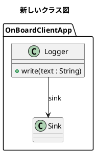

# PlantUmlTool — Next Design × PlantUML 連携

## 2.4.2: 出力の package 経路をグループ名の位置から解決する

2.4.1 は出力した .puml の箱をすべて「対応するモデルがありません」で止めた。出力の package 経路はプロジェクト名から始まり（実機では先頭に OnBoardClient が 2 回続く）、2.4.1 は先頭をルートのモデル名 1 回と決め打ちしてルートから照合していたため。経路の頭は決め打ちせず、経路の中に選んだグループ（またはルート）の名前が出てくる位置の後ろから照合する。実機未確認。

## 2.4.1: 出力した .puml から新しいクラス図を作る

2.4.0 は、既存のクラス図を「表示中の図を出力」した .puml を読ませると「package / component をクラスとして書いたものは扱えません」「入れ子のクラスは扱えません」で止まった。出力では Domain などの箱が `package "名前" as 別名 <<Domain_Impl>> { }` と書かれ、クラスはその中に入るが、2.4.0 は手書きの形（`package "名前" { }` だけ）しか想定していなかった。

2.4.1 は出力の形をそのまま受け付ける。package の経路と箱の名前をモデルの所有経路としてたどり、見つかった箱とクラスはすべて新しい図に載せる。無いクラスだけを作る。箱（package / component）そのものの新規作成は扱わない。title が既存の図と同じ名前なら、後ろに番号を付けた名前で作る。クラスの中に所有されたクラスは出力で箱の直下に書かれるので、直下に無ければ 3 階層下まで探す。実機未確認。

## 2.4.0: 見本の図なしで PlantUML から新しいクラス図を作る

「PlantUMLから新規作成」を作り直した。2.3.x は既存のクラス図を見本（雛形）として写していたため、見本の無いところでは使えなかった。2.4.0 は見本の図を使わない。実機未確認。

1. クラス図グループ（例:「クラス設計」）を開くか選ぶ。クラス図を開いているときは、その図と同じ所有先に作る。
2. プロジェクトを保存しておく（未保存の変更があると止まる）。
3. 「PlantUMLから新規作成」→ `.puml` を選ぶ → 作成の確認 → 反映内容の確認。

図はグループのクラス図欄に作る。どの欄にどのメタクラスで作るかは、グループに既にあるクラス図から決め、無ければプロファイルのエディタ定義から決める。図の名前は `title` 行、無ければファイル名。

クラスの置き場は `package` で書く。



| PlantUML | 扱い |
|---|---|
| `package "名前" { }` | グループ直下の同名モデル（Domain など）。入れ子の package は下の階層。見つからなければプロジェクトの最上位からの経路として探す（出力した .puml の package をそのまま使える） |
| package の中のクラスが、そのモデルに同じ名前である | 既存のクラスを図に載せる。本体 `{ }` を書かなければメンバはそのまま、書けばその内容に合わせる |
| 同じ名前が無い | 新しく作る。メタクラスは、そのモデルが持てるもののうちキーワード（class / interface / enum）とステレオタイプが合うもの。候補が複数なら、そのモデルの既存クラスが使っているものを選ぶ。それでも決まらなければ `<<Unit_Impl>>` のようにステレオタイプを書くよう案内して止まる |

- package で囲んでいないクラスは置き場が決まらないので止まる。
- 箱の形はプロファイルのビュー定義から取る（`FindElementDefByClass`）。
- 関連はモデルに作る。線の表示には既存の線を写す必要があり、同じグループに線のあるクラス図があればそれを写す。無ければ線は表示されない（確認ダイアログと結果で知らせる）。
- 既存のクラス同士の関連は、PlantUML に書いていなくても消さない。
- 途中で 1 回プロジェクトを保存する。反映が失敗・中止したときは、作成した図と仮に作ったクラスを削除する（保存済みのファイルには残るので、上書き保存で確定する）。

反映本体（`63-class-sync-runtime.cs`）には作成中だけ効く分岐を足した。通常の「PlantUMLを反映」の動きは変わらない: 渡された線の雛形で関連を表示する、線の雛形が無いときは線を非表示のまま進める、空のクラスへメンバを足すとき同じ package の同じメタクラスのクラスからメンバのメタクラスを借りる、同じクラスの隣に複数足すとき重ならないよう下へずらす。

2.3.0〜2.3.4 の経緯: 開いている図を見本にする方式で作り、クラス図グループからの実行（2.3.1）、探索の打ち切り（2.3.2）、探索が遅い（2.3.3）、未表示の図はノード 0 件（2.3.4、`.local` の K065）と直したが、見本が無い場合に使えないため 2.4.0 で方式を変えた。

## 2.2.1: 「試行して戻す」ボタンを削除

クラス図の「反映（クラス図）」グループから「試行して戻す」を外した。「PlantUMLを反映」も同じ適用と照合を行い、不一致なら取り消す。反映後は Ctrl+Z で戻せるので、試行を別に挟む必要がない。グループは 差分を検証 / PlantUMLを反映 / 診断表示 の3つになった。

## 2.2.0: クラス図の反映を統合

ClassImportProbe 0.7.2 で実機検証したクラス図の同期本体を `src/60-class-sync.cs` / `61-class-sync-runtime.cs` としてこの拡張に移し、ClassImportProbe は削除した。リボン「PlantUML」タブに「反映（クラス図）」グループ（差分を検証 / PlantUMLを反映 / 試行して戻す / 診断表示）を追加。扱える差分・停止条件・各版の実機手順は [docs/class-sync-history.md](../docs/class-sync-history.md) に残してある。

同時に、クラス図の出力を同期側の読取り＋書出し（`ClassDiagramSnapshot` + `ClassPumlWriter`）に切り替えた。出力と比較が同じ経路になるので、出力した直後のファイルを「差分を検証」に通すと 0 件になることが構成上保証される。出力の見た目の差: 操作の戻り値 `: T` と属性の多重度 `[a..b]` が出るようになった（反映側は「入力に書いてあるときだけ比較」するので、消しても差分にはならない）。関連の矢印はフィールド名ごとの対応表（Related `-->`、SuperClasses `--|>` 等）で出す。オプション `IncludeTitle` / `Theme` / `EmitTimestamp` / `HideEmptyMembers` はヘッダに反映する。それ以外の `ClassPlantUmlOptions` はクラス図の出力には効かなくなった（状態遷移図の出力は引き続き使う）。

診断ファイルは `%LOCALAPPDATA%\NextDesign.ClassSync\reports\` に残る（モデル名・ID を含むので共有しない）。NdMcp 0.2.0 の `/class-sync/*` も同じ本体を転記して使う。

**実機確認（2026-09-22）**: (1) クラス図を開いて「表示中の図を出力」→ 保存した .puml を無編集で「差分を検証」→ 0 件。(2) 属性名を 1 つ変えて「試行して戻す」→ 一致、図は元のまま。(3)「PlantUMLを反映」→ 図が変わり Ctrl+Z で戻る。(4)「選択モデル配下を一括出力」でクラス図・状態遷移図・シーケンス図が従来どおり出る。すべて成功。

## 2.1.3

2.1.3では2.1.2の自由Note出力変更を取り消し、従来の近傍ライフラインを使う`note over`表示へ戻した。処理の近くに注記を表示する見た目を優先する。SequenceImportProbe 0.8.10はこの対象指定を表示位置として扱い、Next Designのアンカー追加指示にはしない。両拡張を更新して再起動する。2.1.2で作成したファイルは再出力する。


2.1.1 では、シーケンス図の破棄後に余分な `activate` / `deactivate` を出力する不具合を修正。破棄メッセージと破棄点の両方に適用する。3拡張の共通回帰テストは `python Tools/Test-SequenceExport.py`。Next Designでの再出力・描画は実機確認待ち。

Next Design V3.x 向けの C# スクリプト拡張機能。

| 図 | 出力（ND → PlantUML） | 反映（PlantUML → ND） |
|---|---|---|
| シーケンス図 | 対応 | SequenceImportProbe で検証中（検証完了後に統合） |
| クラス図 | 対応 | 対応（2.2.0 で既存の図への差分反映、2.4.0 で新しい図の作成） |
| 状態遷移図 | 対応 | 未対応 |

> 旧 `PlantUmlExport` の後継。拡張機能名が変わっているので、**古い `PlantUmlExport` / `DesignExporter` フォルダは削除してから**配置すること（残すと同じ出力ボタンが二重にリボンへ出る）。

---

## 配置

1. 下のどちらかに `PlantUmlTool` フォルダごとコピーする。

   | 配置先 | 適用範囲 |
   |---|---|
   | `%LOCALAPPDATA%\DENSO CREATE\Next Design\extensions\PlantUmlTool\` | そのユーザーのみ |
   | `C:\ProgramData\DENSO CREATE\Next Design\extensions\PlantUmlTool\` | そのPCの全ユーザー |

   `AppData` と `ProgramData` は隠しフォルダ。エクスプローラーで見えない場合は隠しファイルの表示を有効にする。

2. 同じ場所にある古い `PlantUmlExport` フォルダを削除する。
3. **Next Design を再起動する。** 拡張機能は起動時にしか読まれない。

修正したときも同じ手順（ファイルを直す → 再起動）。再起動しないと反映されない。

---

## リボン

「PlantUML」タブに3グループ。

| グループ | ボタン | 動作 |
|---|---|---|
| 出力 | 表示中の図を出力 | アクティブな**シーケンス図・クラス図・状態遷移図**を `.puml` に書き出す（図の種類は自動判別） |
| 出力 | 選択モデル配下を一括出力 | 選択モデル配下のシーケンス図・状態遷移図・クラス図をまとめて書き出す |
| 反映（クラス図） | 差分を検証 | 表示中のクラス図と `.puml` を比較して差分候補を表示する（図は変えない） |
| 反映（クラス図） | PlantUMLを反映 | `.puml` の内容を表示中のクラス図とモデルに反映する（Undo 可） |
| 反映（クラス図） | PlantUMLから新規作成 | クラス図グループの下に、`.puml` の内容で新しいクラス図を作る（2.4.0。見本の図は不要） |
| 反映（クラス図） | 診断表示 | 直前の検証・反映・作成の詳細を表示する |
| 診断 | メタモデル調査 | アクティブな**シーケンス図**のメタモデル構造を出力ウィンドウにダンプする |
| 診断 | クラス図調査 | アクティブな**図（クラス図・状態遷移図とも可）**のノード・コネクタ・参照フィールドをダンプする |

「配下をまとめて出力」は、シーケンス図の出力を終えたあと、状態遷移図・クラス図が
1枚でもあれば続けて出力を実行する（出力先フォルダはそれぞれ別に聞かれる）。
どちらも無いプロジェクトでは何も起きず、従来と同じ操作感になる。

---

## シーケンス図の取り込み

現在のリボンには取り込みボタンがない。ソース内の旧パーサー・ライターは開発用に残っているが、対応済み機能として利用しない。

「V3ではスクリプトによる作成が不可能」「純正PlantUMLImporterを利用する」という以前の説明は根拠を確認できなかったため撤回した。公式SDKにはJSONインポートAPIが存在する。シーケンス図用の入力仕様とサポート範囲は[API調査記録](../docs/sequence-import-api-research.md)を参照する。

---

## 状態遷移図の出力

Next Design の拡張 API には状態遷移図専用のインタフェースが**無い**。クラス図と同じく
`IDiagram` から取れるのはノードとコネクタだけなので、状態・擬似状態・遷移の意味は
**すべてモデル側のメタクラス名とフィールドから取る**。

### 何が出るか

| Next Design 側 | PlantUML |
|---|---|
| 状態（State） | `state "名前" as 別名`。図上の子状態は `state X { ... }` の入れ子 |
| 初期状態・終了状態 | `[*] --> 状態` / `状態 --> [*]`（複合状態内なら親ブロック内に出す） |
| 選択・ジャンクション | `state x <<choice>>` |
| フォーク / ジョイン | `<<fork>>` / `<<join>>` |
| 履歴（浅い / 深い） | `親[H]` / `親[H*]` |
| 入場点 / 退場点 | `<<entryPoint>>` / `<<exitPoint>>` |
| 遷移 | `a --> b : イベント [ガード] / アクション`（空要素は省略、全部空なら遷移モデルの名前） |
| 状態の entry / exit / do | `別名 : entry / 処理` 形式（フィールド値と子モデルの両方式に対応） |

- 自己遷移・同一状態間の複数遷移は 1 コネクタ = 1 本でそのまま全部出す
- 出力は**決定的**。同じ図を2回出せばバイト単位で一致する
- ファイル名は `図名_state.puml`（シーケンス図・クラス図と同じフォルダに出しても衝突しない）

### 図の種類の自動判別

状態遷移図の **EditorType はクラス図と同じ `ERDiagram`**（実機確認済み）のため、次の順で判定する。

1. `StateEditorTypes` / `NonStateEditorTypes`（EditorType の明示指定。既定は空）
2. **`ViewDefinitionName` の完全一致** — 既定は `ステートマシン図` / `状態遷移図` / `StateMachineDiagram` が状態遷移図、`クラス図` / `ClassDiagram` はクラス図
3. 図上ノードのメタクラス名（ClassName と全親クラス名）を `StateClassNames`
   （`Vertex` / `State` / `Pseudostate` / `HistoryState` 等の**完全一致**）と突き合わせ、
   状態系のノードがクラス系以上に多ければ状態遷移図

判定が外れた場合の直し方（`main.cs` の `StatePlantUmlOptions`）:

| 症状 | 直す場所 |
|---|---|
| 状態遷移図がクラス図として出る | `StateViewDefinitionNames` にビュー定義名を追加、または `StateClassNames` に実際のメタクラス名を追加 |
| クラス図が状態遷移図として出る | `NonStateViewDefinitionNames` にビュー定義名を追加 |

### 対応表の埋め方

1. 状態遷移図を開いて**「クラス図調査」**を実行する（任意の図で動く）。
2. 出力ウィンドウの `EditorType` / ノードのクラス名一覧 / コネクタの参照フィールドを確認する。
3. `StateKindMap`（メタクラス名 → state/initial/final/choice/…）、
   `TriggerFieldNames` / `GuardFieldNames` / `ActionFieldNames`（遷移ラベル）、
   `EntryFieldNames` / `ExitFieldNames` / `DoFieldNames`（内部アクション）に実名を写す。

**対応表に無いメタクラスは state 扱いにして警告を出す。** 黙って捨てたり例外で止まったりはしない。

### 既知の制約（状態遷移図）

- 図に載っているノードだけを出力する
- 複合状態の複数領域（`--` 区切り）には対応しない
- 親の無い履歴擬似状態はステレオタイプ付き状態に退避して警告する
- 座標は PlantUML 側に持ち込まない（自動レイアウト）

---

## クラス図の出力

Next Design には `ClassDiagram` というエディタ種別が**存在しない**。クラス図は
`EditorType` が **`ERDiagram`（プロジェクトによっては `TreeDiagram`）**のエディタで、
`ISequenceDiagram` のような型付きアクセサが無く、`IDiagram` から取れるのは
ノードとコネクタだけ。そのためクラス・属性・操作・関連の意味は**すべてモデル側から取る**。

### 何が出るか

| Next Design 側 | PlantUML |
|---|---|
| 図に載っているノードのモデル | `class "名前" as 別名 <<ステレオタイプ>>` |
| メタクラス名（`Interface` / `Enumeration` / …） | `interface` / `enum` / `abstract class` などのキーワード |
| 子モデル（属性とみなしたもの） | `+ 名前 : 型 [多重度] = 既定値` |
| 子モデル（操作とみなしたもの） | `+ 名前(引数 : 型) : 戻り値` |
| モデル間の参照関連 | `-->` `--\|>` `..\|>` `..>` `o--` `*--`（フィールド名から判別） |
| 参照フィールドの多重度 | `a "1" --> "0..*" b` |
| 参照フィールド名 | リンクのラベル（ロール名） |
| 図に載っていないオーナーモデル | `package "名前" { ... }` |

- **図に載っているノードだけを出力する。** モデルツリーにあっても図に描かれていないクラスは出ない。
- **A→B と B→A の両方に参照がある双方向の関連は1本にまとめる**（`a "1" -- "0..*" b`）。汎化・実現はまとめない。
- 出力は**決定的**。同じ図を2回出せばバイト単位で一致する（並び順はノードの座標と別名で固定）。

### メタクラス名・フィールド名の対応表

判別に使う対応表は `main.cs` の `ClassPlantUmlOptions` にある。
**プロファイル依存**なので、思ったとおりに出ない場合はここを直す。

| メンバ | 用途 |
|---|---|
| `KeywordMap` | メタクラス名 → `class` / `interface` / `enum` / `abstract class` … |
| `StereotypeMap` | メタクラス名 → `<<...>>`。空文字を入れるとステレオタイプを出さない |
| `MemberKindMap` | 子モデルのメタクラス名 → `attribute` / `operation` / `literal` / `skip` |
| `LinkMap` | 参照フィールド名 → 矢印 |
| `VisibilityMap` | 可視性の値 → `+` `-` `#` `~` |
| `TypeFieldNames` ほか | 型・多重度・可視値・既定値・引数・戻り値を探すフィールド名の候補 |

**対応表に無いものは既定の扱い（メンバは属性、関連は `-->`）にして警告を出す。**
黙って捨てたり例外で止まったりはしない。警告は出力ウィンドウに `[warn]` 行として出る。

### 対応表の埋め方

1. クラス図を開いて**「クラス図調査」**を実行する。
2. 出力ウィンドウ（カテゴリ `PlantUmlImport`）に次が出る。
   - `EditorType` の実値 ← まずこれを確認する
   - ノード／コネクタの件数
   - ノードと子モデルの `ClassName` 一覧（件数つき）
   - 各コネクタの `IsEmbedded` / `IsReference` / `IsTwoWay` / `SourceField` / `TargetField`
   - 図上のノードどうしを結ぶ参照フィールドの一覧
3. `ClassName` 一覧を `KeywordMap` / `MemberKindMap` に、参照フィールド一覧を `LinkMap` に写す。

### 主なオプション

| オプション | 既定 | 意味 |
|---|---|---|
| `EmitMembers` | `true` | 属性・操作を出す |
| `EmitPackages` | `true` | オーナーを `package` でまとめる |
| `EmitEmbedded` | **`false`** | 所有関連も線にする。属性の親子まで線になるので既定は off |
| `EmitRoleNames` | `true` | リンクのラベルにフィールド名を出す |
| `EmitMultiplicity` | `true` | 多重度を出す |
| `MergeBidirectional` | `true` | 双方向の関連を1本にまとめる |
| `EmitUnknownStereotype` | `true` | 対応表に無いメタクラス名もそのまま `<<...>>` に出す |

---

## 既知の制約

### クラス図

- **図に載っているノードだけを出力する。** モデルツリーにあっても図に無いクラスは出ない
- **所有関連（`IsEmbedded`）は既定で線にしない。** 属性・操作の親子まで線になり図が埋まるため。`EmitEmbedded = true` で出せる
- メタクラス名・フィールド名は**プロファイル依存**。判別できないものは既定の扱い（属性 / `-->`）にして警告を出す
- モデル側で辿れないコネクタは種別なしの `--` で出し、警告する
- 座標は PlantUML 側に持ち込まない（PlantUML が自動レイアウトする）
- 関連クラスは名前をリンクのラベルとして出すだけ。`(A, B) . C` 形式の関連クラス記法には対応しない
- テンプレート／総称型、ポート、内部構造図には対応しない
- 自己参照（同じクラスへの参照）は線にしない
- **取り込み（PlantUML → クラス図）は未対応**

### シーケンス図

- 取り込みは未提供。図や要素の追加・削除・順序変更は行わない。
- `IInteraction.Messages` の順序は作成順であり、図の上からの順序とは限らない。

- 拡張機能の**エントリポイントは1ファイル**（`main.cs`）。分割できない。
- **デバッガは使えない。** C# スクリプトはハンドラの初回呼び出し時にコンパイルされるので、コンパイルエラーもそのタイミングで初めて出力ウィンドウに出る。

---

## 開発

`main.cs` は生成物。`src/*.cs` をファイル名順に連結したもので、編集は `src/` 側で行う。

| ファイル | 内容 |
|---|---|
| `src/00-header.cs` | ヘッダコメントと using |
| `src/05-output-pane.cs` | 出力ウィンドウの表示（AgentReview / NdMcp は自前のものを使うので転記しない） |
| `src/10-sequence-export.cs` | シーケンス図の出力（Part 0） |
| `src/20-sequence-import-legacy.cs` | 旧シーケンス取り込み（Part 1〜5）。リボンから到達しない。`MetaProbe` だけ「メタモデル調査」が使う |
| `src/30-handlers.cs` | コマンドハンドラ（Part 6） |
| `src/40-class-export.cs` | クラス図の出力（Part 7）。本文は 60/61 の Snapshot + Writer で作る |
| `src/45-class-probe.cs` | クラス図調査（`MetaProbe` に依存するので PlantUmlTool 専用） |
| `src/50-state-export.cs` | 状態遷移図の出力（Part 8） |
| `src/60-class-sync.cs` | クラス図同期の純粋部（SDK 非依存。解析・書出し・差分計画・事前判定）。`tests/run_class_sync_tests.py` の対象 |
| `src/61-class-snapshot.cs` | クラス図の読取り（図 → 文書）。出力と同期の両方が使う |
| `src/62-class-sync-ui.cs` | 同期の結果表示と診断ファイル |
| `src/63-class-sync-runtime.cs` | クラス図同期の書込み・照合（SDK 依存） |
| `src/shims/metamap.cs` | AgentReview / NdMcp が転記時に使う `MetaMap` シム。PlantUmlTool の生成には含めない |

**PlantUML 出力の正本はここ。** AgentReview（`python AgentReview/tools/build_main.py`）と NdMcp（`python NdMcp/tools/build_main.py`）は `src/` の 10 / 40 / 50 / 60 / 61（NdMcp は 63 も）を転記して自分の `main.cs` を生成する。出力を直したら 3 つとも再生成する。

```
python PlantUmlTool/tools/build_main.py            # main.cs を再生成
python PlantUmlTool/tools/build_main.py --check    # main.cs が src/ と一致するか
python PlantUmlTool/tests/compile_sdk.py --sdk-root work/sequence-api-research   # 公式 SDK に対するコンパイル検査
python PlantUmlTool/tests/run_class_sync_tests.py   # クラス図同期の純粋部テスト（tests/samples）
```

同期本体や出力を直したら AgentReview（`python AgentReview/tools/build_main.py`）と NdMcp（`python NdMcp/tools/build_main.py`）も再生成し、`compile_sdk.py --main <拡張>/main.cs` で両方をコンパイル検査する。

`manifest.json` を変更したら、配置する前に必ず検証を通すこと。マニフェストの誤りは
Next Design 自体をエラーなしで起動不能にする。

```
python <skills>/nextdesign-script-extension/scripts/validate_manifest.py PlantUmlTool --nd-version 3
```

終了コード 0（WARN のみも可）で合格。
