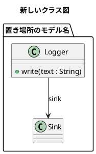

# PlantUmlTool（PlantUML 連携）

Next Design の図と PlantUML（`.puml`）を行き来させる拡張機能です。

| 図 | Next Design → PlantUML（出力） | PlantUML → Next Design（更新・新規作成） |
|---|---|---|
| シーケンス図 | できる | できる |
| クラス図 | できる | できる |
| 状態遷移図 | できる | できない |

出力した `.puml` をテキストエディタや AI で編集し、その内容で元の図を更新したり、新しい図を作ったりできます。

## 必要なもの

- Next Design V3.x

## インストール

配布された `PlantUmlTool` フォルダ一式を次のどちらかに置き、Next Design を再起動します。

| 置き場所 | 使える人 |
|---|---|
| `%LOCALAPPDATA%\DENSO CREATE\Next Design\extensions\PlantUmlTool\` | 自分だけ |
| `C:\ProgramData\DENSO CREATE\Next Design\extensions\PlantUmlTool\` | その PC の全ユーザー |

`AppData` と `ProgramData` は隠しフォルダです。エクスプローラーで見えないときは、隠しファイルを表示する設定にしてください。

- 同じ場所に古い `PlantUmlExport` / `DesignExporter` フォルダがあれば削除してください。残っていると、同じ出力ボタンがリボンに2つ出ます。
- 更新するときは Next Design を終了してからフォルダの中身を入れ替えます。起動中は差し替えられません。

## リボン

「PlantUML」タブに次のボタンが出ます。

| グループ | ボタン | 内容 |
|---|---|---|
| 出力 | 表示中の図を出力 | 開いている図を `.puml` に書き出す。図の種類は自動で見分ける |
| | 選択モデル配下を一括出力 | 選んだモデルの下にある図をまとめて書き出す |
| 反映 | PlantUMLで更新 | `.puml` の内容で、開いているシーケンス図またはクラス図を更新する |
| | PlantUMLから新規作成 | `.puml` の内容で新しいシーケンス図またはクラス図を作る |

## 図を出力する

### 開いている図を1枚出力する

1. シーケンス図・クラス図・状態遷移図のどれかを開きます。
2. 「表示中の図を出力」を押し、保存先のファイル名を指定します。

出力ウィンドウにも同じ内容が表示されます。

### まとめて出力する

1. ナビゲータでモデルを選びます。何も選んでいなければ、開いているモデルかプロジェクト全体が対象です。
2. 「選択モデル配下を一括出力」を押します。件数を確認したあと、出力先フォルダを選びます。

出力先には次の形でファイルができます。

```
<出力先>\
├── _index.md                     シーケンス図の一覧
├── シーケンス図\<図グループ>\…\<図名>.puml
├── クラス図\<図グループ>\…\<図名>_class.puml
└── 状態遷移図\<図グループ>\…\<図名>_state.puml
```

- フォルダは、図をまとめているグループの名前から図の親モデルまでの階層です。
- ライフラインが1本もないシーケンス図は飛ばします。
- 既にあるファイルは自動では消しません。前回と出力対象が変わる場合は、新しいフォルダを選ぶのが確実です。

### 出力される内容

- 図に描かれている要素だけを出力します。モデルツリーにあっても図に載っていないクラスや状態は出ません。
- 座標は持ち込みません。配置は PlantUML の自動レイアウトになります。
- 同じ図を2回出力すると、まったく同じファイルになります。差分管理に使えます。

クラス図の主な対応:

| Next Design | PlantUML |
|---|---|
| 図上のクラス | `class "名前" as 別名 <<ステレオタイプ>>`（インタフェースや列挙は `interface` / `enum`） |
| 属性 | `+ 名前 : 型 [多重度] = 既定値` |
| 操作 | `+ 名前(引数 : 型) : 戻り値` |
| 関連・汎化・実現など | `-->` `--\|>` `..\|>` `..>` `o--` `*--`（多重度とロール名つき） |
| 図に載っていない所有者 | `package "名前" { ... }` |

双方向の関連は1本にまとめます。所有関係（属性や操作の親子）は線にしません。

状態遷移図の主な対応:

| Next Design | PlantUML |
|---|---|
| 状態 | `state "名前" as 別名`。子状態は入れ子 |
| 初期状態・終了状態 | `[*] --> 状態` / `状態 --> [*]` |
| 選択・フォーク・ジョイン | `<<choice>>` / `<<fork>>` / `<<join>>` |
| 履歴（浅い / 深い） | `親[H]` / `親[H*]` |
| 入場点・退場点 | `<<entryPoint>>` / `<<exitPoint>>` |
| 遷移 | `a --> b : イベント [ガード] / アクション` |
| entry / exit / do | `別名 : entry / 処理` |

見分けられない要素は、捨てずに既定の扱い（クラス図なら属性や `-->`、状態遷移図なら状態）で出力し、出力ウィンドウに `[warn]` 行で知らせます。

## PlantUML で図を更新する

1. 更新したいシーケンス図またはクラス図を開きます。
2. 「PlantUMLで更新」を押し、`.puml` ファイルを選びます。
3. 変わる内容が表示されるので、確認して進めます。

更新したあと図を読み直して PlantUML と照合し、一致したときだけ確定します。一致しなければ元に戻します。反映できない差分があるときは、理由を表示して止まります。結果の画面に診断ファイルの場所が出ます。

更新の元にする `.puml` は、このツールで出力したものを編集するのが確実です。

### シーケンス図の場合

保存していない変更があると、先に保存するかを聞かれます。

| 選択 | 結果 |
|---|---|
| OK（保存してから更新） | 作業中の他の変更も一緒に保存されます。更新は Ctrl+Z で戻せます |
| キャンセル（保存せずに更新） | Ctrl+Z で戻すと、図は最後に保存した状態の図形に戻ります。保存後に追加した図形は、今回の更新で触れていなくても消えます |

更新のあとプロジェクトは保存しません。

### クラス図の場合

- 図とモデルの両方を更新します。
- 関連を追加するときは、プロジェクトを保存して未保存の変更がない状態で実行してください。自動では保存しません。
- PlantUML に書いていない既存の関連は消しません。
- 更新は Ctrl+Z で戻せます。
- 扱える変更と止まる条件の詳細は [クラス図同期の記録](../docs/class-sync-history.md) にあります。

## PlantUML から新しい図を作る

1. 図を置く場所を決めます。
   - シーケンス図かクラス図を開いていれば、その図の隣に同じ種類の図を作ります。
   - モデルを開いているか選んでいるときは、そのモデルに置ける種類の図を作ります。シーケンス図とクラス図のどちらも置ける場合は、どちらにするかを聞かれます。
2. 「PlantUMLから新規作成」を押し、`.puml` ファイルを選びます。
3. 確認画面で内容を確かめて進めます。

既存の図を見本にする必要はありません。

### シーケンス図の場合

プロジェクトは保存しません。作成を取り消したいときは、保存せずにプロジェクトを開き直してください。

### クラス図の場合

先にプロジェクトを保存してください。未保存の変更があると止まります。作成の途中で1回保存します。図の名前は `title` 行から、無ければファイル名から付けます。

クラスの置き場所は `package` で書きます。


```plantuml
@startuml
title 新しいクラス図
package "置き場所のモデル名" {
  class "Logger" {
    + write(text : String)
  }
  class "Sink"
}
Logger --> Sink : sink
@enduml
```

| PlantUML の書き方 | 扱い |
|---|---|
| `package "名前" { }` | グループの下にある同じ名前のモデルを置き場所にします。入れ子の package は下の階層です。出力した `.puml` の package もそのまま使えます |
| package の中のクラスと同じ名前のクラスがある | 既存のクラスを図に載せます。`{ }` を書かなければメンバはそのまま、書けばその内容に合わせます |
| 同じ名前のクラスが無い | 新しく作ります。種類はキーワード（class / interface / enum）とステレオタイプから決めます。決まらないときは `<<ステレオタイプ>>` を書くよう案内して止まります |

- package で囲んでいないクラスは、置き場所が決まらないので止まります。
- 箱（package に書いたモデル）そのものは新しく作りません。既にあるモデルを指定してください。
- 関連はモデルに作ります。同じグループに線のあるクラス図が無いと、線が図に表示されないことがあります。そのときは確認画面と結果で知らせます。
- 途中で失敗・中止したときは、作った図と仮に作ったクラスを削除します。途中で1回保存しているので、そのあと上書き保存すると削除が確定します。

## 制約

- 状態遷移図の更新・新規作成はできません。
- 状態遷移図の複合状態の複数領域（`--` 区切り）には対応しません。
- クラス図の関連クラス記法 `(A, B) . C`、テンプレート（総称型）、ポート、内部構造図には対応しません。自分自身への参照は線にしません。
- メタクラス名やフィールド名はプロファイルによって違います。思ったとおりに出力されないときは、拡張機能の管理者に相談してください。
- シーケンス図のメッセージは、作成順に並ぶことがあります。図の上からの順と違う場合があります。

## 困ったとき

| 症状 | 対処 |
|---|---|
| リボンに出力ボタンが2つある | 古い `PlantUmlExport` / `DesignExporter` フォルダを削除して再起動する |
| 「状態遷移図には対応していません」と出る | 状態遷移図は出力だけに対応しています |
| 「反映先のシーケンス図かクラス図を開いてから実行してください」と出る | 更新したい図をエディタで開いてから押す |
| 「ここにはシーケンス図もクラス図も作れません」と出る | 図を置けるモデルを開くか選んでから押す。表示される理由も確認する |
| クラス図の更新が「保存してから実行してください」で止まる | プロジェクトを保存してからやり直す |
| 状態遷移図がクラス図として出力される（またはその逆） | 図の見分けはプロファイルに依存します。管理者に相談する |
| 更新・作成で止まった理由を詳しく知りたい | 結果の画面に出る診断ファイル（`%LOCALAPPDATA%\NextDesign.SequenceSync\reports` または `NextDesign.ClassSync\reports`）を開く。モデル名や ID を含むので、社外には出さない |

開発・保守向けの情報（仕組み、ビルド、テスト、変更履歴）は [DEVELOPMENT.md](DEVELOPMENT.md) にあります。
