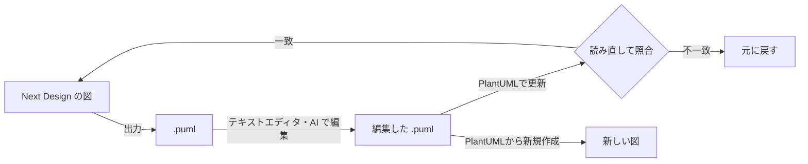
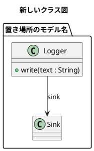
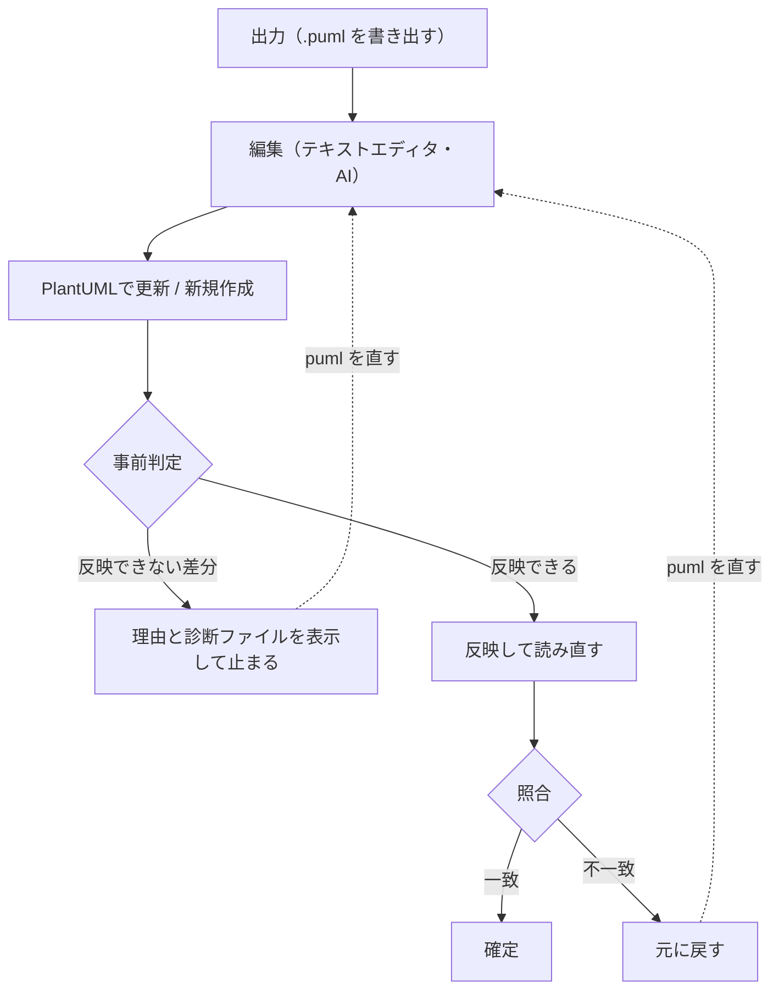

# はじめに

本文書は PlantUmlTool（表示名「PlantUML 連携」）の紹介である。Next Design の図と PlantUML（`.puml`）を行き来させる拡張機能である。

図をテキストにすれば、差分管理やテキストエディタ・AI での編集ができる。編集した結果を図へ戻す手作業をなくすために作った。

# 何ができるようになるか

Next Design の図を `.puml` に書き出し、編集した `.puml` で元の図を更新したり、新しい図を作ったりできるようになる。

| 図 | Next Design → PlantUML（出力） | PlantUML → Next Design（更新・新規作成） |
|---|---|---|
| シーケンス図 | できる | できる |
| クラス図 | できる | できる |
| 状態遷移図 | できる | できない |

使い方の例:

- 開いているクラス図を「表示中の図を出力」で `.puml` にし、AI に属性を足させてから「PlantUMLで更新」で図へ戻す
- 設計モデルを選んで「選択モデル配下を一括出力」を押し、配下の図をまとめて Git で差分管理する
- AI に書かせた複数の `.puml` を「PlantUMLから新規作成」でまとめて選び、シーケンス図を一度に作る

## できないこと

- **状態遷移図の更新・新規作成はできない。** 出力だけに対応している。
- **状態遷移図の複合状態の複数領域（`--` 区切り）には対応しない。**
- **クラス図の関連クラス記法 `(A, B) . C`、テンプレート（総称型）、ポート、内部構造図には対応しない。** 自分自身への参照は線にしない。
- **図の座標は持ち込まない。** 出力した `.puml` の配置は PlantUML の自動レイアウトになる。
- **図に載っていない要素は出力しない。** モデルツリーにあっても、図に描かれていないクラスや状態は出ない。
- **シーケンス図のメッセージは作成順に並ぶことがある。** 図の上からの順と違う場合がある。
- **プロファイルが違うと思ったとおりに出力されないことがある。** メタクラス名やフィールド名はプロファイルごとに違うため。管理者に相談する。

# 全体像


```mermaid
flowchart LR
    ND[Next Design の図] -- 出力 --> P[".puml"]
    P -- テキストエディタ・AI で編集 --> P2["編集した .puml"]
    P2 -- PlantUMLで更新 --> C{読み直して照合}
    C -- 一致 --> ND
    C -- 不一致 --> R[元に戻す]
    P2 -- PlantUMLから新規作成 --> N[新しい図]
```

出力した `.puml` を編集して戻すのが基本の使い方である。更新は反映した図を読み直して `.puml` と照合し、一致したときだけ確定する。

配布フォルダの主なファイル:

```
PlantUmlTool/
├── PlantUmlTool.dll   ← 本体
├── manifest.json      ← リボンとコマンドの定義
└── resources/         ← リボンのアイコン
```

# 環境構築

| 必要なもの | 用途 |
|---|---|
| Next Design V3.x | 拡張機能を動かす |
| 配布された `PlantUmlTool` フォルダ一式 | 拡張機能本体 |

配布フォルダを次のどちらかに置き、Next Design を再起動する。

| 置き場所 | 使える人 |
|---|---|
| `%LOCALAPPDATA%\DENSO CREATE\Next Design\extensions\PlantUmlTool\` | 自分だけ |
| `C:\ProgramData\DENSO CREATE\Next Design\extensions\PlantUmlTool\` | その PC の全ユーザー |

自分だけに入れる場合は、Next Design を終了してから PowerShell で次を実行する。

```powershell
# 配布フォルダの中身を自分用の拡張機能フォルダへコピーする（[配布フォルダ] は PlantUmlTool フォルダの場所）
Copy-Item -Recurse -Force "[配布フォルダ]\*" "$env:LOCALAPPDATA\DENSO CREATE\Next Design\extensions\PlantUmlTool\"
# 確認：True と表示されれば配置できている
Test-Path "$env:LOCALAPPDATA\DENSO CREATE\Next Design\extensions\PlantUmlTool\manifest.json"
```

Next Design を起動すると、リボンに「PlantUML」タブが出る。

- 更新するときも Next Design を終了してからフォルダの中身を入れ替える。起動中は差し替えられない。
- 同じ場所に古い `PlantUmlExport` / `DesignExporter` フォルダがあれば削除する。残っていると、同じ出力ボタンがリボンに2つ出る。

<details>
<summary>エクスプローラーでフォルダが見えないとき</summary>

`AppData` と `ProgramData` は隠しフォルダである。エクスプローラーで隠しファイルを表示する設定にするか、アドレス欄に上の置き場所をそのまま貼り付けて開く。

</details>

# 使い方

リボンの「PlantUML」タブのボタン:

| グループ | ボタン | 内容 |
|---|---|---|
| 出力 | 表示中の図を出力 | 開いている図を `.puml` に書き出す。図の種類は自動で見分ける |
| | 選択モデル配下を一括出力 | 選んだモデルの下にある図をまとめて書き出す |
| 反映 | PlantUMLで更新 | `.puml` の内容で、開いているシーケンス図またはクラス図を更新する |
| | PlantUMLから新規作成 | `.puml` の内容で新しいシーケンス図またはクラス図を作る |

## 開いている図を1枚出力する

1. シーケンス図・クラス図・状態遷移図のどれかを開く。
2. 「表示中の図を出力」を押す。
3. **保存先のファイル名を聞かれるので指定する。**

出力ウィンドウにも同じ内容が表示される。

## まとめて出力する

1. ナビゲータでモデルを選ぶ。複数選んだときはモデルパス順で最初の1つが起点になる。何も選んでいなければ、開いているモデルかプロジェクト全体が対象になる。
2. 「選択モデル配下を一括出力」を押す。
3. **件数の確認が出るので進め、出力先フォルダを選ぶ。**

出力先には次の形でファイルができる。

```
[出力先]\
├── _index.md                                  ← シーケンス図の一覧
├── シーケンス図\[図グループ]\…\[図名].puml
├── クラス図\[図グループ]\…\[図名]_class.puml
└── 状態遷移図\[図グループ]\…\[図名]_state.puml
```

- フォルダは、図をまとめているグループの名前から図の親モデルまでの階層になる。
- `_index.md` のリンク先は、日本語のまま読める `<…>` 形式で書く（`#` と `%` だけ符号化する）。
- ライフラインが1本もないシーケンス図は飛ばす。
- 既にあるファイルは自動では消さない。

## 出力される内容

同じ図を2回出力すると、まったく同じファイルになる。

クラス図の主な対応:

| Next Design | PlantUML |
|---|---|
| 図上のクラス | `class "名前" as 別名 <<ステレオタイプ>>`（インタフェースや列挙は `interface` / `enum`） |
| 属性 | `+ 名前 : 型 [多重度] = 既定値` |
| 操作 | `+ 名前(引数 : 型) : 戻り値` |
| 関連・汎化・実現など | `-->` `--\|>` `..\|>` `..>` `o--` `*--`（多重度とロール名つき） |
| 図に載っていない所有者 | `package "名前" { ... }` |

双方向の関連は1本にまとめる。所有関係（属性や操作の親子）は線にしない。

状態遷移図の主な対応:

| Next Design | PlantUML |
|---|---|
| 状態 | `state "名前" as 別名`。子状態は入れ子 |
| 初期状態・終了状態 | `[*] --> 状態` / `状態 --> [*]` |
| 選択・フォーク・ジョイン | `<<choice>>` / `<<fork>>` / `<<join>>` |
| 履歴（浅い / 深い） | `親[H]` / `親[H*]` |
| 入場点・退場点 | `<<entryPoint>>` / `<<exitPoint>>` |
| 遷移 | `a --> b : イベント [ガード] / アクション` |
| entry / exit / do | `別名 : entry / 処理` |

見分けられない要素も捨てずに、既定の扱い（クラス図なら属性や `-->`、状態遷移図なら状態）で出力する。そのときは出力ウィンドウに `[warn]` 行が出る。

## PlantUML で図を更新する

1. 更新したいシーケンス図またはクラス図を開く。
2. 「PlantUMLで更新」を押し、`.puml` ファイルを選ぶ。
3. **シーケンス図で未保存の変更があると、先に保存するかを聞かれる。** 下の表を見て選ぶ。
4. **変わる内容が表示されるので、確認して進める。**

反映できない差分があるときは、理由を表示して止まる。結果の画面に診断ファイルの場所が出る。

シーケンス図で未保存の変更があるときの選択:

| 選択 | 結果 |
|---|---|
| OK（保存してから更新） | 作業中の他の変更も一緒に保存される。更新は Ctrl+Z で戻せる |
| キャンセル（保存せずに更新） | Ctrl+Z で戻すと、図は最後に保存した状態の図形に戻る。保存後に追加した図形は、今回の更新で触れていなくても消える |

シーケンス図の更新のあと、プロジェクトは保存しない。

クラス図の場合:

- 図とモデルの両方を更新する。
- 関連を追加するときは、プロジェクトを保存して未保存の変更がない状態で実行する。自動では保存しない。
- PlantUML に書いていない既存の関連は消さない。
- 更新は Ctrl+Z で戻せる。
- 扱える変更と止まる条件の詳細は [クラス図同期の記録](../docs/class-sync-history.md) にある。

## PlantUML から新しい図を作る

1. 図を置く場所を決める。
   - シーケンス図かクラス図を開いていれば、その図の隣に同じ種類の図を作る。
   - モデルを開いているか選んでいるときは、そのモデルに置ける種類の図を作る。
2. 「PlantUMLから新規作成」を押し、`.puml` ファイルを選ぶ。Ctrl / Shift で複数選べる。
3. **シーケンス図とクラス図のどちらも置ける場所なら、どちらにするかを聞かれる。**
4. **確認画面で内容を確かめて進める。**
5. **シーケンス図で ref の参照先の候補が複数あるときは、どれにするかを聞かれる。** 複数ファイルを選んだときも1件ずつ聞かれる。

既存の図を見本にする必要はない。

複数ファイルの一括作成（3.4.0）は実機で未確認である。複数ファイルを選んだときは、すべて手順1で決まった場所・種類の図として作る。確認は最初の1回、結果は最後の1回だけ出る。作れなかったファイルはその分だけ取り消して次へ進み、結果の一覧に理由が出る。

シーケンス図の場合:

- プロジェクトは保存しない。作成を取り消したいときは、保存せずにプロジェクトを開き直す。
- 同じ一括作成で後から作った図には ref を結び付けない。互いに参照する図は、あとで参照先を設定する。

クラス図の場合:

- 先にプロジェクトを保存しておく。未保存の変更があると止まる。
- 作成の途中で1回保存する。複数選んだときは1件作るごとに保存し、作れなかったファイルの図とクラスは削除してその状態を保存する。
- 図の名前は `title` 行から付ける。無ければファイル名から付ける。
- 途中で失敗・中止したときは、作った図と仮に作ったクラスを削除する。途中で1回保存しているので、そのあと上書き保存すると削除が確定する。

クラスの置き場所は `package` で書く。


```plantuml
@startuml
title 新しいクラス図
package "置き場所のモデル名" {
  class "Logger" {
    + write(text : String)
  }
  class "Sink"
}
Logger --> Sink : sink
@enduml
```

| PlantUML の書き方 | 扱い |
|---|---|
| `package "名前" { }` | グループの下にある同じ名前のモデルを置き場所にする。入れ子の package は下の階層になる。出力した `.puml` の package もそのまま使える |
| package の中のクラスと同じ名前のクラスがある | 既存のクラスを図に載せる。`{ }` を書かなければメンバはそのまま、書けばその内容に合わせる |
| 同じ名前のクラスが無い | 新しく作る。種類はキーワード（class / interface / enum）とステレオタイプから決める。決まらないときは `<<ステレオタイプ>>` を書くよう案内して止まる |

- package で囲んでいないクラスは、置き場所が決まらないので止まる。
- 箱（package に書いたモデル）そのものは新しく作らない。既にあるモデルを指定する。
- 関連はモデルに作る。同じグループに線のあるクラス図が無いと、線が図に表示されないことがある。そのときは確認画面と結果で知らせる。

# ベストプラクティス

- **更新の元にする `.puml` は、このツールで出力したものを編集する。** 出力と比較が同じ書き方なので、手で書いた `.puml` より差分が意図どおりになる。
- **クラス図を更新・作成する前にプロジェクトを保存する。** 関連の追加や新規作成は、未保存の変更があると止まる。
- **シーケンス図を保存せずに更新したら、Ctrl+Z の挙動に注意する。** 最後に保存した状態の図形に戻り、保存後に足した図形も消える。
- **一括出力で前回と対象が変わるときは、新しいフォルダを選ぶ。** 既存のファイルは消さないので、古い図の `.puml` が残る。
- **互いに ref で参照するシーケンス図を一括作成したら、参照先をあとで設定する。** 同じ一括作成で後から作った図には ref を結び付けない。
- **診断ファイルを社外に出さない。** モデル名や ID を含む。

# ワークフロー


```mermaid
flowchart TD
    E["出力（.puml を書き出す）"] --> M["編集（テキストエディタ・AI）"]
    M --> S["PlantUMLで更新 / 新規作成"]
    S --> P{事前判定}
    P -- 反映できない差分 --> D["理由と診断ファイルを表示して止まる"]
    D -.puml を直す.-> M
    P -- 反映できる --> A["反映して読み直す"]
    A --> C{照合}
    C -- 一致 --> OK["確定"]
    C -- 不一致 --> R["元に戻す"]
    R -.puml を直す.-> M
```

## 担当と機械検査

| 工程 | ツールが行うこと | ユーザーが行うこと | 機械検査 |
|---|---|---|---|
| 出力 | 図に載っている要素を `.puml` に書き出す | 図を開く、またはモデルを選ぶ | なし（見分けられない要素は `[warn]` で知らせる） |
| 編集 | なし | `.puml` を編集する | なし |
| 事前判定 | 差分を計算し、反映できるかを判定する | 変わる内容を確認して進める | 事前判定 |
| 反映・照合 | 図（クラス図はモデルも）に反映し、読み直して `.puml` と比べる | なし | 照合 |
| 保存 | クラス図の新規作成だけ途中で保存する | 結果を Next Design で確かめ、残すなら保存する | なし |

照合が一致したら完了とする。一致しなければツールが元に戻す。

## 機械で見ているもの・見ていないもの

機械で見ているもの:

| 検査 | 内容 |
|---|---|
| 事前判定 | 差分がこのツールで反映できる種類か。未保存の変更があるか（クラス図の関連追加・新規作成） |
| 照合 | 反映後の図を読み直した内容が、指定した `.puml` と一致するか |

見ていないもの（人の確認に残る）:

- 図の見た目（配置・線の重なり）。座標は持ち込まない
- 設計として正しいか。`.puml` に書いたとおりに反映されたことしか確かめない
- `.puml` に書いていない既存の関連（クラス図の更新では消さないので、残ったままになる）
- シーケンス図のメッセージの並び順が図の上からの順と合っているか

# カスタマイズ

利用者が設定で変えられる項目はない。出力の対応表や図の見分け方は、ソースの定数を直してビルドし直す。パスは `PlantUmlTool/` からの相対パスである。直し方とビルドの手順は [DEVELOPMENT.md](DEVELOPMENT.md) にある。

| ファイル | 現状 | 変えたくなる場面と編集方法 |
|---|---|---|
| `src/50-state-export.cs` の `StatePlantUmlOptions` | ビュー定義名 `ステートマシン図` / `状態遷移図` / `StateMachineDiagram` を状態遷移図、`クラス図` / `ClassDiagram` をクラス図とみなす | 状態遷移図がクラス図として出る（またはその逆）。`StateViewDefinitionNames` / `NonStateViewDefinitionNames` / `StateClassNames` に実際の名前を足す |
| `src/40-class-export.cs` の `ClassPlantUmlOptions` | メタクラス名・フィールド名の対応表 | プロファイルが違い、キーワードや矢印が思ったとおりに出ない。`KeywordMap` / `MemberKindMap` / `LinkMap` などに実名を写す |
| `src/15-export-runner.cs` の `ExportSettings` | `GroupFolders = true`、`WriteIndexFile = true`、`SkipEmptyDiagram = true` | 一括出力を種別・図グループのフォルダに分けたくない（`GroupFolders`）、`_index.md` が要らない（`WriteIndexFile`） |

出力や同期のソースは AgentReview・NdMcp・SequenceImportProbe・ClassImportProbe もビルドしている。直したら、使っている拡張をすべてビルドし直す。

# 困ったとき

| 症状 | まず見るところ |
|---|---|
| リボンに出力ボタンが2つある | 古い `PlantUmlExport` / `DesignExporter` フォルダを削除して再起動する |
| 「状態遷移図には対応していません」と出る | 状態遷移図は出力だけに対応している |
| 「反映先のシーケンス図かクラス図を開いてから実行してください」と出る | 更新したい図をエディタで開いてから押す |
| 「ここにはシーケンス図もクラス図も作れません」と出る | 図を置けるモデルを開くか選んでから押す。表示される理由も確認する |
| クラス図の更新が「保存してから実行してください」で止まる | プロジェクトを保存してからやり直す |
| 状態遷移図がクラス図として出力される（またはその逆） | 図の見分けはプロファイルに依存する。管理者に相談する（カスタマイズ章の `StatePlantUmlOptions`） |
| 更新・作成で止まった理由を詳しく知りたい | 結果の画面に出る診断ファイル（`%LOCALAPPDATA%\NextDesign.SequenceSync\reports` または `%LOCALAPPDATA%\NextDesign.ClassSync\reports`）を開く |

# 関連

- `AgentReview`：設計情報と図を書き出して AI にレビューさせる。図の `.puml` はこのツールと同じ出力エンジンで作る
- `NdMcp`：AI（MCP クライアント）から Next Design を読み書きさせる。クラス図・シーケンス図の同期はこのツールと同じ本体を使う
- `ClassImportProbe` / `SequenceImportProbe`：同期の差分検証・診断表示・調査を行う開発用の拡張。利用者は使わない
- 開発・保守向けの情報（仕組み、ビルド、テスト、変更履歴）：[DEVELOPMENT.md](DEVELOPMENT.md)
