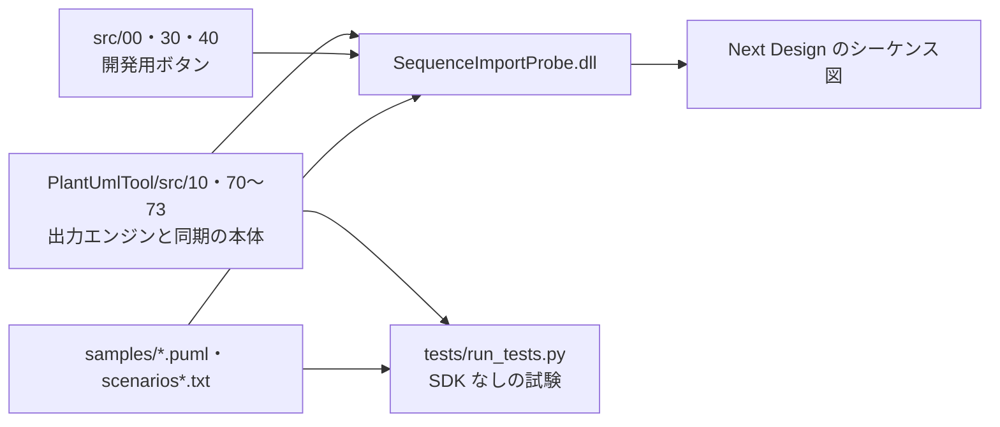
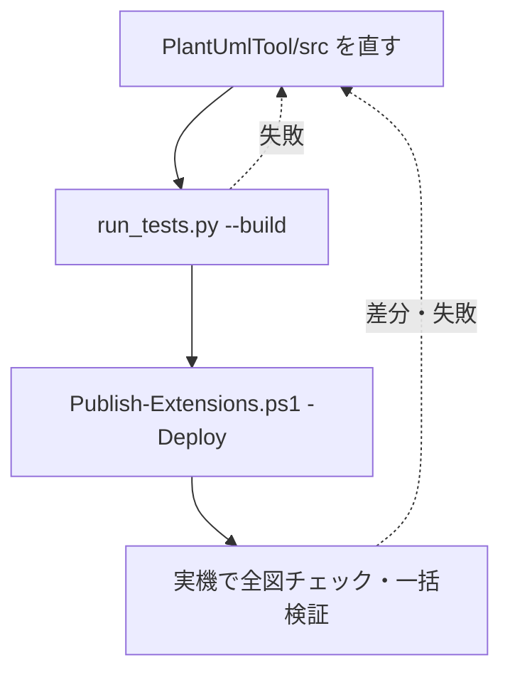

# はじめに

本文書は SequenceImportProbe（リボン表示名「シーケンス生成実験」）の紹介である。PlantUmlTool のシーケンス図同期を開発し、実機で確かめるための開発用 DLL 拡張である。

同期の本体は PlantUmlTool にあり、利用者向けのボタンは反映と新規作成だけに絞ってある。差分の中身を見る、全図を一度に照合する、製品の挙動を切り分けるといった開発中にしか要らない操作を、ここに分けて置いている。

# 何ができるようになるか

開いているプロジェクトのシーケンス図に対して、PlantUML との差分の検証、反映、全図の往復照合、シナリオ一覧による一括検証ができる。製品 API の挙動を調べる調査ボタンもある。

| グループ | ボタン | 内容 |
|---|---|---|
| 結果・診断 | 診断表示 | 直前の結果の要約と詳細をページ送りで表示する |
| | 保存なし反映の調査 | SDK から読める値で組み立てた写しと、ExportModelUnit の書き出しをキーごとに比べる。読取りのみ |
| | メタモデル調査 | 開いているシーケンス図のメタモデル構造を出力ウィンドウに書く |
| | 書き戻し調査（コピーで） | SDK で読めない値を抜いて取り込み直し、何が残るかを数える。保存するのでプロジェクトのコピーで使う |
| 取込・比較 | PlantUML取込 | PlantUML から図を作る旧来の取込（`PlantUmlTool/src/73-sequence-create.cs` の `SequenceExperiment` と `src/40-legacy-import.cs` のパーサ） |
| | 差分を検証 | 開いている図と PlantUML の差分を計算して表示する。書き込みはしない |
| | 全図チェック | プロジェクトの全シーケンス図を PlantUmlTool と同じ方法で書き出し、読み戻して元の図と比べる。書き込み・保存はしない |
| 反映 | PlantUMLを反映 | PlantUmlTool の反映と同じ処理を実行する |
| | シナリオ一括検証 | before/after の組を並べた一覧を読み、新しい図に before を作って after を反映し、照合する |
| | 一括検証（保存なし写し） | 上と同じ一括検証を、書き出しの代わりに SDK から組み立てた写しで行う |
| | Ctrl+Z 切り分け | 写しの一部だけを置き換えて反映し、どの違いが Ctrl+Z を壊すかを確かめる |
| | 削除の Ctrl+Z 切り分け | 図で選んだ要素を反映と同じ API で削除するだけの操作で、Ctrl+Z が戻るかを確かめる |

依頼の例:

- 「全図チェックで差分の出た図を調べて」
- 「`scenarios-smoke.txt` で一括検証を回して」

## できないこと

- **利用者向けの機能ではない。** 同期を使うだけなら PlantUmlTool の「PlantUMLを反映」「PlantUMLから新規作成」を使う。
- **シナリオ一括検証は、開いているプロジェクトを自動で保存する。** 実験用にコピーしたプロジェクトで実行する（確認ダイアログでも案内が出る）。
- **ローカルテストは Next Design を動かさない。** 取込・取消・描画が実機で成功するかは、Next Design 上で確かめる。

# 全体像



同期の本体は PlantUmlTool のソースをそのままビルドする。SequenceImportProbe が持つのは開発用のボタンだけである。

```
SequenceImportProbe/
├── SequenceImportProbe.csproj   ← ビルドするソースを記載順に列挙する（PlantUmlTool/src の 05・10・15・70〜73 を含む）
├── manifest.json                ← リボンとコマンドの定義
├── src/
│   ├── 00-extension.cs          ← エントリポイントとボタンのハンドラ
│   ├── 30-dev-tools.cs          ← シナリオ一括検証・全図チェック・保存なし反映の調査・書き戻し調査・Ctrl+Z 切り分け
│   └── 40-legacy-import.cs      ← 旧取込のパーサと AST、メタモデル調査
├── samples/                     ← 試験と一括検証に使う PlantUML とシナリオ一覧
├── tests/                       ← SDK なしで同期の純粋部を試験する C# テストと Python のランナー
├── DIFFERENTIAL_UPDATE.md       ← 差分更新の方針（版ごとの記録を含む）
└── HISTORY.md                   ← 旧 README の版履歴（0.9.4 まで）
```

# 環境構築

.NET SDK と、Visual Studio なしでのビルド環境は [DLL 形式エクステンションの開発環境](../docs/dll-extension-setup.md) にまとめてある。

| 必要なもの | 用途 |
|---|---|
| .NET SDK | DLL のビルド |
| Python | `tests/run_tests.py` の実行 |
| Next Design V3.x | 実機確認 |

リポジトリ直下で実行する。

```powershell
# SDK なしの試験（サンプルの PlantUML 検査・同期の純粋部・シミュレーション）
python SequenceImportProbe/tests/run_tests.py
# 上に加えて DLL をビルドする（NuGet の NextDesign 3.1.3 を参照）
python SequenceImportProbe/tests/run_tests.py --build
# ビルドして extensions フォルダへ配置する（Next Design を終了してから）
powershell -NoProfile -ExecutionPolicy Bypass -File Tools/Publish-Extensions.ps1 -Name SequenceImportProbe -Deploy
```

`-Deploy` は Next Design の起動中なら止まる。DLL は起動時にしか読み込まれないためである。配置先は `%LOCALAPPDATA%\DENSO CREATE\Next Design\extensions\SequenceImportProbe\` で、配置前の中身は `work\deploy-backup\` に退避される。

# 使い方

## 全図チェック

1. 対象のプロジェクトを開き、「全図チェック」を押す。
2. ダイアログに枚数・所要時間・結果の内訳が出る。差分の出た図の詳細は「診断表示」で見る。
3. 全件の結果は `%LOCALAPPDATA%\NextDesign.SequenceSync\sweep\[日時]\` の `result.tsv`・`detail.txt`・`kinds.txt` に残る。

書き込まないので、実際のプロジェクトで実行してよい。

## シナリオ一括検証

1. 実験用にコピーしたプロジェクトを開き、シーケンス図を1つ開く。新しい図はその図と同じ親の下に作られる。
2. 「シナリオ一括検証」を押し、シナリオ一覧（`.txt`）を選ぶ。出力済みの `.puml` を選ぶと往復照合になる。
3. **確認ダイアログに答える。** 「OK」は図を作って反映・照合し、途中で自動保存する。「キャンセル」は前回作った図を保存せずに再検証する（開き直した後に使う）。
4. 結果は一覧と同じ場所の `[一覧名].result.tsv` に書かれる。

シナリオ一覧は1行1件で、`名前 | before | after` と書く。`#` で始まる行は読み飛ばす。パスは一覧からの相対である。

| 一覧 | 用途 |
|---|---|
| `samples/scenarios-smoke.txt` | 一括検証そのものの確認用。全件の前に流す |
| `samples/scenarios.txt` | 全件 |
| `samples/scenarios-rest.txt`・`scenarios-sim.txt` | 部分集合 |

1件も成功しないまま2件続けて失敗すると、残りを実行せずに中断する。

# ベストプラクティス

- **一括検証は `scenarios-smoke.txt` から始める。** 仕組みの不具合を少ない件数で拾える。
- **保存を伴うボタンはコピーしたプロジェクトで使う。** シナリオ一括検証と書き戻し調査はプロジェクトを保存する。
- **同期の不具合は PlantUmlTool/src を直す。** ここでビルドしているのは PlantUmlTool と同じファイルなので、直したら PlantUmlTool も含めて使う拡張をすべてビルドし直す。
- **`src/` のソース順を崩さない。** テストは csproj の記載順に連結したソースから `SequencePayload` 以降を切り出して試験する。

# ワークフロー



## 担当と機械検査

| 工程 | ツールが行うこと | 開発者が行うこと | 機械検査 |
|---|---|---|---|
| 修正 | なし | 同期の本体を直す | なし |
| ローカル試験 | サンプル検査・純粋部の試験・ビルド | 結果を見る | `run_tests.py` |
| 配置 | publish・manifest 検査・配置 | Next Design を終了しておく | `validate_manifest.py`（見つかったとき） |
| 実機確認 | 書き出し・反映・照合 | ボタンを押して結果を読む | 全図チェック・一括検証の照合 |

## 機械で見ているもの・見ていないもの

`run_tests.py` が見るもの:

| 対象 | 検査内容 |
|---|---|
| `samples/*.puml` | PlantUML 自体が受け付ける形か（`lint_samples.py`） |
| 同期の純粋部 | パース・差分計画・事前判定・Editor JSON の組み立て（`tests/*.cs`） |
| シナリオ | シミュレーションでの反映結果 |
| `--build` 指定時 | DLL がビルドできるか |

見ていないもの（実機確認に残る）:

- Next Design 上での取込・取消・描画の成否
- 製品の Undo の挙動
- 実プロファイルのメタモデルへの適合

# 困ったとき

| 症状 | まず見るところ |
|---|---|
| 配置で止まる | Next Design が起動していないか |
| 一括検証が2件で中断する | 一覧の行の形とパス。`scenarios-smoke.txt` で仕組みを確かめる |
| 調べた事実を探したい | `.local/nd-knowledge/index.md` |

# 関連

- `PlantUmlTool`：同期の本体と、利用者向けの反映・新規作成ボタンを持つ。
- `ClassImportProbe`：クラス図同期の開発用拡張。
- [シーケンス同期の計画](../docs/sequence-sync-plan.md)・[引き継ぎ](../docs/sequence-sync-handoff.md)：到達点と経緯。
