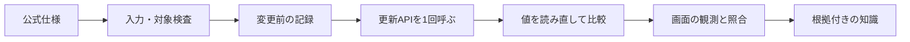

# はじめに

Next Design v3系の設計更新を、APIの仕様と実機の観測を分けて検証する。対象読者は、Next Designのモデルとフィールドを理解し、拡張を開発・検証する担当者。

現在の実装は単値文字列属性1件の `SetField` と読戻し、手動Undo/Redo後の照合。実機の成功結果はまだ受領していない。配置と操作は [ModelUpdateProbeの手順書](../ModelUpdateProbe/README.md) を参照する。

# インプット資料

| 資料 | 確認する内容 |
|---|---|
| [v3 IModel](https://docs.nextdesign.app/extension/v3.x/api/NextDesign.Core/IModel/) | `IsEditable`、`GetField`、`SetField`などのモデルAPI |
| [v3 SetField](https://docs.nextdesign.app/extension/v3.x/api/NextDesign.Core/IModel/methods/SetField) | 引数、型、所有・参照、多値の挙動 |
| [v3 IField](https://docs.nextdesign.app/extension/v3.x/api/NextDesign.Core/IField/) | 型名、所有・参照、多重度 |
| [v3 ICommonUI](https://docs.nextdesign.app/extension/v3.x/api/NextDesign.Desktop/ICommonUI/) | 基本ダイアログ |
| [知識の保存手順](nd-knowledge.md) | 受領した結果と知識の保存先・確度 |

# 概要



APIの正常終了と、期待する値になったことは別の観測である。例外があっても一部変更が起きた可能性があるため、呼出結果と読戻し結果を別々に残す。

# 詳細説明

## 単値文字列の更新

公式仕様では、`IField.Type` の文字列型名は `String`。上限多重度が1、参照ではなく、クラス型・列挙型でもないフィールドを対象とする。`IsEmbedded` 単独では除外しない。所有モデルとの区別には `TypeClass` を使う。モデルの編集可否を確認してから `GetField` で変更前を取得し、確認画面の後にもう一度読み直す。

次は呼び出し形を示す例。`model` は検査済みの対象、`Description` は架空のフィールド名であり、どのプロファイルにも存在するとは限らない。

```csharp
object before = model.GetField("Description");
model.SetField("Description", "PROBE_TEST_001");
object after = model.GetField("Description");
```

`SetField` が例外なく戻っても、他の拡張のイベント処理などを含めた最終結果は読戻しで確認する。上の例だけでは実運用に必要な対象検査・記録・例外処理を満たさない。

多値フィールドへの `SetField` は先頭要素を設定する。モデルを所有するフィールドへの代入は既存モデルの削除や指定モデルの移動を伴うため、初版の文字列検証と混ぜない。リッチテキストも専用の検証対象とする。

## シーケンス図内の対象取得

0.2.0では選択モデルを `IInteraction` として取得し、`Messages` からメッセージモデルを列挙する。`Lifelines` は対象を照合するための一覧として保存する。両プロパティは[v3 IInteraction](https://docs.nextdesign.app/extension/v3.x/api/NextDesign.Core/IInteraction/)に定義されている。メッセージは作成順、ライフラインは図の左からの順序で返る。

メッセージの属性候補を会社PC内の `targets.txt` に書き、利用者が1件のIDとフィールド名を指定する。準備時の候補IDと実行時の所属を検査し、同じ `SetField`・読戻し処理へ渡す。図の表示反映は別の観測とし、属性の一致だけで表示成功としない。

## 記録と判定

| 記録 | 意味 |
|---|---|
| 呼出：未呼出 | 更新APIに到達していない |
| 呼出：正常終了 | `SetField` が例外なく戻った |
| 呼出：例外 | `SetField` の呼び出しで例外を捕捉した |
| 期待値：一致 | 対象フィールドの完全な文字列を期待値と序数比較して一致 |
| 期待値：不一致 | 読み取りはできたが期待値と違う |
| 期待値：未確認 | 読み取り失敗などで比較できない |

長文は確認画面だけ省略し、比較とログには全文を使う。元の `null` と空文字を区別する。フィールド単体の一致をプロジェクト全体の整合性や復元の証明にはしない。

呼出前ログを保存できなければ更新しない。呼出後のログ保存に失敗した場合は、要約画面で保存失敗を示す。自動の逆操作は行わず、会社PC上で状態を確認する。

## Undo/Redoの観測

拡張はUndo/Redoを実行しない。本体で操作した後、担当者が段階を選んで値を照合する。これによりコマンドをまたいだ状態を観測するが、履歴の単位や他フィールドへの副作用まで検証したことにはならない。

## 知識として残す範囲

| 確度 | 根拠 |
|---|---|
| 公式仕様で確認 | 上記v3リファレンス。実機成功とは区別 |
| 模擬試験で確認 | 配布スクリプトを模擬SDKでコンパイルし、処理境界を検査 |
| 実機で確認 | 会社PCの結果画面、ログ、観測報告。受領状況と適用範囲はローカル索引で管理 |

会社固有の結果は `.local/nd-knowledge/` に原文と対象情報を保存する。製品の版とプロファイルの版を分け、不明な場合は未分類のまま保持する。この共有文書には、固有名詞・ID・値を転記しない。

今後の追加・移動・参照・削除は、文字列更新の実機結果を受領してから別ケースとして検証する。APIごとに成功条件と失敗条件を記録し、実装の存在だけで動作済みにしない。

## コマンド間の対象確認

0.2.1ではプロジェクトIDと保存先を準備時に記録し、現在のプロジェクトと照合する。保存先は絶対パスに正規化し、Windowsの大文字小文字を区別せず比較する。未保存のプロジェクトは準備対象にしない。

現在のプロジェクトの `GetModelById` で対象を再取得する。このAPIは削除済みモデルも返すため、欠落に加えて `IsDeleted` と `IsProxy` を検査する。仕様は[v3 IProject](https://docs.nextdesign.app/extension/v3.x/api/NextDesign.Core/IProject/)を参照。シーケンスでは再取得した相互作用内から対象メッセージを探す。オブジェクト参照の同一性には依存しない。

同じID・保存先でのプロジェクト再読み込みは検出しない。再読み込みや開き直しの後は再準備する。

## 入力画面からの検証

0.3.0の通常操作では、一覧からメッセージを選び変更後の名前を入力する。拡張は選択番号を準備済みのIDへ対応付け、Nameだけを対象とした設定を自動作成する。入力画面からモデルIDや属性名を受け取らず、入力中の名前変更・プロジェクト切替も更新前に確認する。0.4.0では入力画面を拡張内の.NETフォームに置き換えた。専用STAスレッドには名前だけを渡し、SDKに触れず選択結果を返す。モデル更新はNext Design側の既存処理が実行する。PowerShellの起動や実行ポリシーの変更は行わない。
