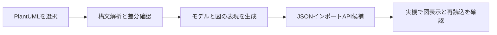

# はじめに

Next Design V3系で、PlantUMLから編集可能なシーケンス図を作成・更新するための調査記録。対象読者は拡張機能の開発担当者。公開SDKのインポートAPIと公式サンプルの保存形式を基に、[最小生成実験](../SequenceImportProbe/README.md)を実装した。入力形式の正式仕様は未確認であり、実機結果を使って仮説を検証する。

# インプット資料

| 出所 | 確認内容 |
|---|---|
| [公式V2.0リリースノート](https://www.nextdesign.app/support/releases/2.0.1.20104/) | 拡張機能で他ツールのシーケンス図データを変換・取り込みできる旨の記載 |
| [V3 シーケンス図のモデルの操作](https://docs.nextdesign.app/extension/v3.x/how-to/models/editors/sequence/sequence-overview) | 構造フィールドの変更にビューが追従しない制約 |
| [V3 ISequenceDiagram](https://docs.nextdesign.app/extension/v3.x/api/NextDesign.Core/ISequenceDiagram/) | 要素の取得API。ライフライン・メッセージの追加メソッドは一覧にない |
| [公式NuGet NextDesign.Core 3.1.3.30714](https://www.nuget.org/packages/NextDesign.Core/3.1.3.30714) | DLLの公開インタフェースと付属XMLドキュメントを確認 |
| [公式サンプル](https://github.com/denso-create/NextDesign-Samples/tree/main/extensions) | 公開ファイル一覧でシーケンス生成専用サンプルを見つけられなかった |

SDKの版はアプリケーションの詳細版と別に記録する。SDKに型が存在することだけでは、対象の実機で利用できることや製品のサポート範囲は確定しない。

# 概要



現在の不足はCの正式な入力仕様。公式サンプルでモデル・関連・シェイプを含む保存構造を観察し、実験用データの根拠とする。差分更新には、さらに既存IDと外部参照の扱いを確定する必要がある。

# 詳細説明

## SDKに存在したインポートAPI

`NextDesign.Core.dll` の公開 `IProject` インタフェースには次のメソッドがある。WebのAPI一覧だけでは見つからなかったため、NuGetのDLLとXMLの両方を調べた。

```csharp
IUnitImportResult ImportUnitFromJson(string unitJson, IModel owner, string field);
```

付属XMLによると、入力はユニットファイル構造のJSON文字列で、プロジェクトの保存形式がSQLiteでもJSONでも動作する。`owner` と `field` は追加先を指定し、入力の `TopElementId` が指すモデルをその子要素として追加する。`owner` がnullの場合には所有・参照の関連付けを呼出側で行う必要がある。

戻り値には `State`、`TopElement`、`ImportedModels`、`ImportedRelations`、`ImportedEditors`、`Errors` がある。モデルとエディタを取り込む経路の候補だが、シーケンス作成の正式な推奨経路かは未確認。

## まだ確定していないこと

- シーケンス図を含むユニットJSONの必須レコード、スキーマ版、IDの対応関係。
- ライフライン、実行仕様、メッセージ、シェイプの接続と座標の表現。
- 入力エラー時の部分適用、トランザクション、Undo/Redoの契約。
- 同じIDを再インポートした場合の更新・重複・拒否の挙動。
- V3.1.9での利用可否と、このメソッドの製品サポート範囲。

`AddNewModel` と構造フィールドへの `SetField` を組み合わせた旧ライターは再公開しない。生成実験では、公式サンプルの保存構造と現在のプロファイルの型IDを使い、新しい図だけをインポートする。未確認のスキーマ互換性と既定値は実験の仮説として記録する。

## 開発元への問い合わせ案（未送信・実験の前提にはしない）

> Next Design V3.1.9のC#スクリプト拡張で、PlantUMLからシーケンス図を生成し、将来的に既存図へ差分を反映したいと考えています。最初の検証対象はライフライン2本と同期メッセージ1本の新規図です。
>
> V2.0のリリースノートには、拡張によるシーケンス図の作成・他ツールからの取り込み対応が記載されています。一方、V3のHow Toには構造フィールド変更へビューが追従しない制約があります。
>
> 1. V3.1.9で推奨される生成APIまたはライブラリと、最小のC#サンプルをご案内いただけますか。
> 2. 公式NuGet NextDesign.Core 3.1.3.30714の `IProject.ImportUnitFromJson` は、この用途で利用するサポート対象APIでしょうか。利用可能なら、シーケンス図を含む入力JSONの仕様と最小例をいただけますか。
> 3. このAPIの失敗時の部分適用・ロールバック・Undo/Redoの契約と、既存モデルIDを保持した更新への対応状況を教えてください。

## 実験の検証範囲

最初は既存図を変更せず、別の新規図として最小例を作る。入力はGUIで受け取り、JSONやIDを利用者に編集させない。生成直後のライフライン・メッセージ数、送受信先、図の表示、保存して開き直した結果、Undo/Redoを確認する。この結果を得てから、複合フラグメントと既存図への差分反映に進む。

会社固有のメタモデルや実機結果はこの文書へ転記せず、[知識の保存手順](nd-knowledge.md)に従ってローカルに保存する。
